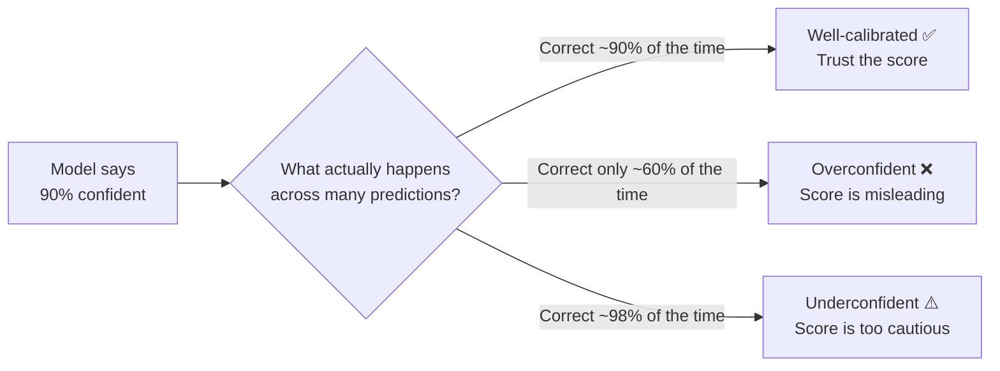

# Model Calibration

---

## Learning Objectives

By the end of this topic, you should be able to:

- Explain what it means for a model to be well-calibrated, overconfident, or underconfident
- Explain why a model's stated confidence score is not automatically trustworthy just because it sounds precise
- Perform a simple calibration check by hand using the bucket-and-compare method
- Evaluate whether a given AI system's confidence scores can be trusted for a specific decision-making use case

---

## Overview

Many AI systems do not just give you an answer — they also give you a **confidence score**. "I am 92% sure this is correct." "There is an 85% chance this loan will be repaid."

Here is a question every AI engineer must learn to ask: **can you actually trust that number?**

Just because a model says "95% confident" does not mean it is correct 95% of the time. A model can have high overall accuracy and still produce confidence scores that are completely misleading. This topic gives you a concrete, numerical way to check whether a model's stated confidence actually means something — or is just a number it learned to output.

---

## What Is Calibration?

**Calibration** is the measure of whether a model's stated confidence matches its real-world accuracy over many predictions.

- A **well-calibrated** model: when it says "90% confident," it is correct about 90% of the time across many such predictions
- An **overconfident** model: when it says "90% confident," it is actually only correct, say, 60% of the time — the model is more sure of itself than it should be
- An **underconfident** model: when it says "40% confident," it turns out to be correct 70% of the time — the model is less sure of itself than it should be

**Simple analogy:**
Think about a weather app that says "90% chance of rain" every single day. If it actually rains only 50% of those days, the app is badly overconfident — its 90% means nothing. But if a different app says "70% chance of rain" and it rains about 70% of those days over hundreds of predictions, that app is well-calibrated — its stated probability actually means something you can trust.



**Important:** Calibration and accuracy are two completely separate properties. A model can be right most of the time (high accuracy) but still have confidence scores that mean nothing (poor calibration). Always check both — never assume one implies the other.

### Key Terms

| Term | Simple Meaning |
|---|---|
| **Confidence score** | The probability the model reports alongside its answer — e.g. "92% sure this is fraud" |
| **Actual accuracy (per bucket)** | Of all predictions the model made at roughly that confidence level, what percentage were actually correct |
| **Calibration gap** | The difference between stated confidence and actual accuracy. A large gap = poor calibration |

---

## How to Check Calibration by Hand

Before any method or formula — let's understand what we are actually trying to do
with a simple everyday example.

**Imagine your friend claims to be great at predicting football match results.**

Every time a big match happens — Premier League, Champions League, World Cup — your
friend says things like:
- "I am 90% sure Manchester City will win this one"
- "I am 60% sure Real Madrid will win this one"
- "I am 40% sure Brazil will win this one"

After 50 matches, you sit down and check. Of all the times your friend said "90% sure"
— did the team actually win 90% of those matches? Or did they win only 60% of them?

If your friend said "90% sure" 20 times, and the team won only 12 of those — your
friend is **overconfident**. They were right only 60% of the time but claiming 90%
certainty. Their confidence is not trustworthy.

This is exactly what calibration checking does — but for an AI model instead of
your friend.

**The method — four simple steps:**

**Step 1 — Collect predictions**

Gather the model's predictions on data it has never seen before. For each prediction,
record three things: what the model predicted, how confident it said it was, and
whether it was actually correct.

**Step 2 — Group by confidence level**

Sort all predictions into buckets based on the confidence score — all "around 90%
confident" predictions in one group, all "around 70% confident" in another, and so on.

Think of it like sorting your friend's predictions — put all the "90% sure" matches
in one pile, all the "60% sure" matches in another.

**Step 3 — Calculate actual accuracy per bucket**

For each group ask: of all the predictions in this bucket, what percentage were
actually correct?

```
Actual accuracy = Correct predictions in this bucket ÷ Total predictions in this bucket
```

**Step 4 — Compare and judge**

Compare the stated confidence to the actual accuracy for each bucket:
- If they are close → well-calibrated
- If stated confidence is much higher than actual accuracy → overconfident
- If stated confidence is much lower than actual accuracy → underconfident

### Worked Calibration Check

A medical triage AI is tested on 45 real, doctor-verified cases. Here are its predictions grouped by stated confidence:

| Confidence Bucket | Predictions | Actually Correct | Actual Accuracy | Calibration Gap | Verdict |
|---|---|---|---|---|---|
| ~90% confident | 20 | 12 | 12÷20 = **60%** | 90% − 60% = **+30 points** | Badly **overconfident** ❌ |
| ~60% confident | 15 | 9 | 9÷15 = **60%** | 60% − 60% = **0 points** | **Well-calibrated** ✅ |
| ~40% confident | 10 | 6 | 6÷10 = **60%** | 40% − 60% = **−20 points** | **Underconfident** ⚠️ |

**What this table is telling us:**

Going back to the football friend analogy — imagine your friend predicted "90% sure" on 20 matches and only got 12 right. That is exactly what the first row shows. The AI said "90% confident" 20 times but was only correct 60% of the time — a 30-point gap.

Look carefully at the "Actual Accuracy" column — it is 60% in every single row. The model is equally reliable regardless of how confident it claims to be. But its stated confidence swings wildly from 40% to 90% for predictions that are, in reality, all equally reliable.

- When the model says "I am 90% sure" — it is only right 60% of the time. That is a 30-point gap. This is badly overconfident and dangerous for any automated decision that relies on this threshold
- When the model says "I am 60% sure" — it is right 60% of the time. Perfect match. Well-calibrated
- When the model says "I am 40% sure" — it is still right 60% of the time. The model is unnecessarily cautious here — underconfident

**The key insight:** This model's confidence scores in the 90% bucket are not trustworthy. If a system was set to auto-approve decisions above 85% confidence, it would be acting on a number that only reflects 60% real-world accuracy — a serious risk.

---

## Calibration and Temperature

You already learned about temperature — the setting that controls how confident or creative an LLM's output is. Temperature directly affects calibration.

Think of it like this. Imagine the same football friend, but now they have two moods:
- In **conservative mood** (low temperature) — they only predict matches they feel very strongly about, and they always say "90% sure" even for moderately uncertain games. Their stated confidence is high, but their actual accuracy hasn't changed — so they now appear overconfident
- In **adventurous mood** (high temperature) — they spread their predictions widely and say "50% sure" even for games they are actually quite confident about. Their actual accuracy is the same — but now they appear underconfident

The AI model works the same way:

- **Low temperature** — the model strongly favours its top prediction and may output very high confidence scores even when the underlying probability distribution is not that sharp. This can make the model appear overconfident
- **High temperature** — the model spreads probability more evenly across options, which may make it appear underconfident even when one answer is clearly more likely

This means a well-calibrated model at temperature 1.0 may become poorly calibrated if you lower the temperature to 0.2 — the same model, the same knowledge, but now outputting confidence scores that no longer match its real accuracy.

**Practical implication:** If you change the temperature setting for any LLM-based system, re-run your calibration check. Do not assume the confidence scores are still trustworthy just because the model was calibrated at a different temperature setting.

---

## Worked Example — Skin Condition Screening App

**Scenario:** An AI-based skin condition screening app is tested on 100 real, doctor-verified photos. It groups its predictions by stated confidence.

**Before the numbers — what are we checking?**
We want to know: if this app says "95% confident this needs a dermatologist review," can we actually trust that 95%? Or is it just a number?

| Confidence Bucket | Predictions | Actually Correct | Actual Accuracy | Calibration Gap |
|---|---|---|---|---|
| ~95% confident | 40 | 39 | 39÷40 = **97.5%** | 95% − 97.5% = **−2.5 points** |
| ~70% confident | 40 | 27 | 27÷40 = **67.5%** | 70% − 67.5% = **+2.5 points** |
| ~50% confident | 20 | 9 | 9÷20 = **45%** | 50% − 45% = **+5 points** |

**Reading the results:**

- 95% bucket: gap of −2.5 points — essentially well-calibrated, very slightly underconfident
- 70% bucket: gap of +2.5 points — essentially well-calibrated
- 50% bucket: gap of +5 points — slightly overconfident but still reasonable

**The judgment call:**

> This model is reasonably well-calibrated across all three confidence bands — every gap is under 5 percentage points. This is a good sign. A dermatologist clinic could reasonably use these confidence scores to prioritise which cases to review first — high-confidence flags reviewed quickly, low-confidence flags reviewed with extra care. However, even a well-calibrated AI screening tool must route final diagnosis decisions to a qualified doctor. The model assists the doctor's judgment — it does not replace it.

**Contrast with the medical triage example above:**
The triage model had a 30-point calibration gap in its high-confidence bucket — its 90% confidence scores only reflected 60% real accuracy. That model's confidence scores should not be used for any automated decision threshold. This skin screening model, with gaps under 5 points, is in a completely different position.

---

## Best Practices

- Never trust a confidence score at face value without checking it against real outcomes on unseen test data
- For high-stakes decisions (loan approval, medical triage, academic integrity), require a calibration check before allowing confidence scores to influence any automated threshold
- Re-check calibration periodically — a well-calibrated model at launch can drift as real-world data changes
- If you change the temperature setting on an LLM system, always re-run the calibration check

## Common Beginner Mistakes

- **Assuming a stated percentage is a rigorous probability** — for many AI systems, especially LLMs describing their own certainty in words, the confidence number is itself just another prediction, not a guaranteed mathematical truth
- **Testing calibration on training data** — this will make any model look artificially well-calibrated. Always use fresh, unseen test cases
- **Confusing high confidence with high accuracy** — as the medical triage table shows, these can point in completely different directions
- **Assuming calibration is permanent** — a model calibrated at launch on one dataset may become miscalibrated as real-world data patterns shift over time

---

## Key Takeaways

- **Calibration** checks whether a model's stated confidence matches its real-world accuracy — this is a completely separate check from accuracy alone
- **Overconfident** = stated confidence higher than actual accuracy. **Underconfident** = stated confidence lower than actual accuracy
- The bucket-and-compare method: group predictions by confidence level, calculate actual accuracy per bucket, compare the two numbers
- A model can be highly accurate overall but badly calibrated — always check both properties separately
- **Temperature affects calibration** — changing the temperature setting on an LLM can shift its confidence scores even without changing its underlying knowledge
- Never test calibration on training data — always use fresh, unseen, real-world test cases
- A well-calibrated model's confidence scores can be used to prioritise review effort. A poorly calibrated model's confidence scores should never drive automated decisions alone

> **Interview tip:** If asked "how would you check if a model's confidence scores are trustworthy?" — describe the bucket-and-compare method: collect predictions with confidence scores and ground truth, group by confidence level, calculate actual accuracy per bucket, and compare the gap. Most candidates cannot answer this question at all. You now can.

---

## Reference Links

- 📎 [Google Machine Learning Crash Course — Classification thresholds](https://developers.google.com/machine-learning/crash-course) — foundational framing of confidence and thresholds
- 📎 [NIST AI Risk Management Framework — Measure Function](https://www.nist.gov/itl/ai-risk-management-framework) — official guidance on measuring AI trustworthiness including confidence reliability
- 📎 [Towards Data Science — Calibration of Machine Learning Models](https://towardsdatascience.com/calibration-techniques-of-machine-learning-models-d4f1a9c7a6f) — accessible explanation of calibration with visual examples
