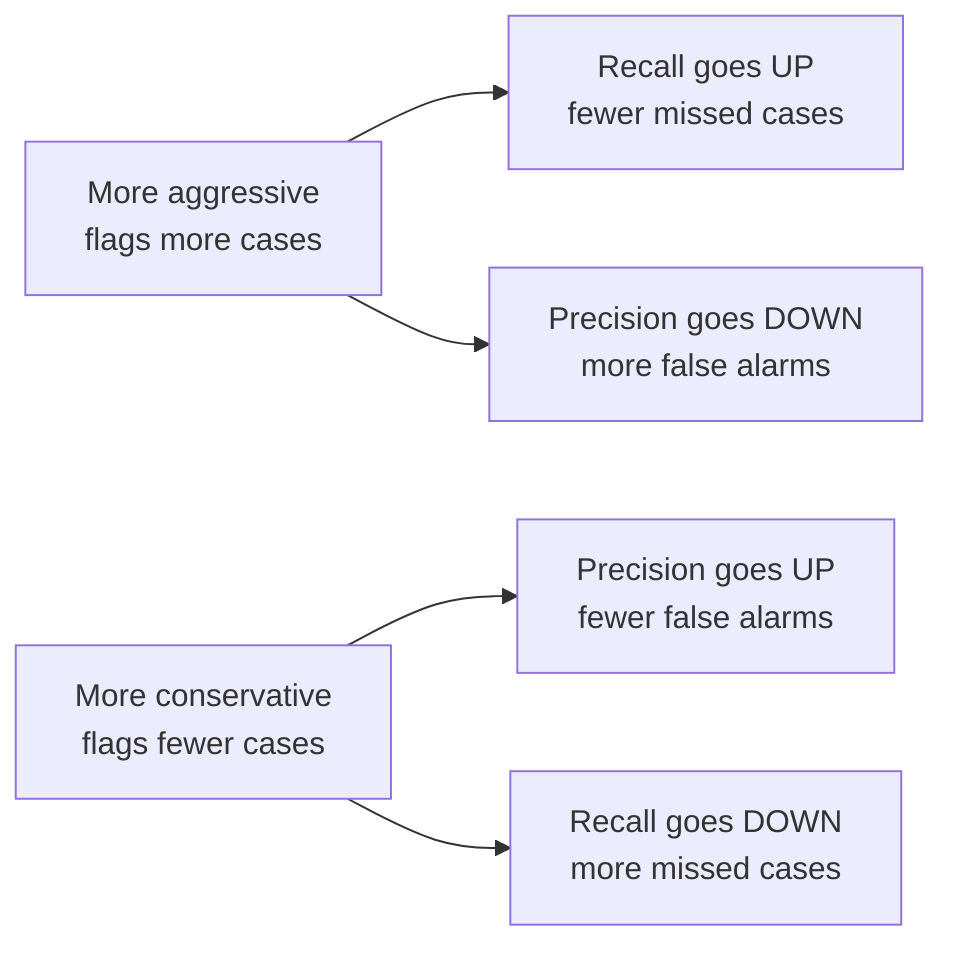

# Evaluation Metrics in Depth

---

## Learning Objectives

By the end of this topic, you should be able to:

- Explain why precision and recall pull in opposite directions and what causes the trade-off
- Decide which metric matters more for a specific real-world scenario and justify your choice
- Calculate accuracy, precision, recall, and F1 score by hand from a confusion matrix
- Interpret what each metric result means in plain English for the specific use case
- Make a justified recommendation about whether a model is fit for deployment based on its metrics

---

## Overview

You already know what precision, recall, and the confusion matrix are. This topic goes deeper — you will now use all four metrics together to make a real judgment call about whether a model is actually fit for a specific use case.

The key shift: in real AI engineering work, the numbers alone are never the answer. The question is always — given what these numbers mean for this specific system, is this model good enough to deploy?

---

## Precision vs Recall — Why the Trade-off Exists

You know the definitions. Now the important question: **why can't we just maximise both?**

Think of a doctor deciding which patients to send for further testing. The doctor has two ways to make an error:

- Send a healthy patient for unnecessary tests — **false alarm (False Positive)**
- Miss a sick patient and send them home — **missed case (False Negative)**

To reduce false alarms, the doctor becomes more conservative — only flags patients who show very clear symptoms. Result: fewer healthy patients are disturbed, but some genuinely sick patients with mild symptoms get missed.

To reduce missed cases, the doctor becomes more aggressive — flags anyone with even a hint of a symptom. Result: almost no sick patient is missed, but many healthy patients are sent for unnecessary tests.

**This is the trade-off.** Making the model more aggressive always improves recall at the cost of precision. Making it more conservative always improves precision at the cost of recall. There is no setting that maximises both simultaneously — you must choose which type of mistake is more costly for your specific use case.



**The key question to always ask before looking at any numbers:**
> "Which mistake is more costly for this specific system — a false alarm or a missed case?"

- If a **false alarm** is more costly → optimise for **precision**
- If a **missed case** is more costly → optimise for **recall**
- If both carry similar cost → use **F1** to balance them

---

## F1 Score — Why the Harmonic Mean, Not a Simple Average

You already know the F1 formula. The deeper question is: **why use the harmonic mean instead of just averaging precision and recall?**

Imagine a disease screening model with:
- Precision = 100% — every patient it flags actually has the disease
- Recall = 1% — it only catches 1% of actual patients who have the disease

A simple average says: `(100 + 1) / 2 = 50.5%` — "not bad."

But this model is nearly useless. It misses 99% of real cases. The simple average hides the disaster by letting a perfect precision score cancel out a terrible recall.

The harmonic mean punishes this imbalance:
```
F1 = 2 × (1.0 × 0.01) / (1.0 + 0.01)
   = 2 × 0.01 / 1.01
   ≈ 0.02 = 2%
```

An F1 of 2% correctly tells you the model is broken — regardless of how good one metric looks.

**The rule:** The harmonic mean always pulls toward the weaker number. A model cannot hide a terrible recall behind a perfect precision, or vice versa.

**When to use F1:** When both false alarms and missed cases carry similar costs and you need one single number to compare models or track progress over time.

---

## Computing All Four Metrics by Hand

### The Scenario

A hospital has deployed an AI system that screens chest X-rays for signs of pneumonia. The system was tested on 200 X-rays. We want to answer one question: **is this model reliable enough to use in a real clinical setting?**

**Before we calculate — what should we expect?**
For a medical screening system, **missed cases are more dangerous than false alarms**. A false alarm means an extra check-up for a healthy patient — inconvenient but not harmful. A missed case means a sick patient goes home untreated. So **recall matters more here** — we need to look very carefully at how many real pneumonia cases the model missed.

**The confusion matrix:**

| | Predicted: Pneumonia | Predicted: Healthy |
|---|---|---|
| **Actual: Pneumonia** | TP = 72 | FN = 8 |
| **Actual: Healthy** | FP = 20 | TN = 100 |

**What each cell means in this context:**

| Term | In this example | Real-world impact |
|---|---|---|
| **TP = 72** | Correctly identified pneumonia | Patient gets correct treatment |
| **FN = 8** | Missed pneumonia — said "healthy" | Sick patient sent home untreated |
| **FP = 20** | False alarm — said "pneumonia" | Healthy patient sent for unnecessary tests |
| **TN = 100** | Correctly identified healthy | Patient correctly cleared |

**How the formulas connect to the confusion matrix — visual guide:**

```
                 Predicted: Pneumonia    Predicted: Healthy
Actual: Pneumonia      TP = 72    ←─┐        FN = 8  ←─┐
                                    │                   │
Actual: Healthy        FP = 20  ←─┘        TN = 100    │
                                                        │
Precision = TP ÷ (TP + FP)                             │
Uses the PREDICTED POSITIVE column ─────────────────────┘ (not used)

Recall = TP ÷ (TP + FN)
Uses the ACTUAL POSITIVE row ── TP and FN both come from row 1
```

---

**Step 1 — Sanity check** *(always do this first)*

> Add all four cells. Do they equal the total number tested?

```
TP + FN + FP + TN = 72 + 8 + 20 + 100 = 200 ✓
```

Row totals:
```
Actual pneumonia patients = TP + FN = 72 + 8  = 80
Actual healthy patients   = FP + TN = 20 + 100 = 120
```

Everything adds up. The matrix is correctly filled — we can proceed.

---

**Step 2 — Accuracy** *(what proportion of all predictions were correct?)*

```
Accuracy = (TP + TN) / Total
         = (72 + 100) / 200
         = 172 / 200
         = 86%
```

> 86% sounds good. But this tells us nothing about *which* 14% of errors occurred or how harmful they were. We need the next three metrics to find out.

---

**Step 3 — Precision** *(of every X-ray flagged as pneumonia, how many actually had it?)*

```
Precision = TP / (TP + FP)
          = 72 / (72 + 20)
          = 72 / 92
          ≈ 78.3%
```

> About 1 in 5 flags is a false alarm — a healthy patient sent for unnecessary follow-up tests. Adds cost and anxiety, but not clinically dangerous.

---

**Step 4 — Recall** *(of all actual pneumonia patients, how many did the model catch?)*

```
Recall = TP / (TP + FN)
       = 72 / (72 + 8)
       = 72 / 80
       = 90%
```

> The model caught 90% of real pneumonia cases — but missed 10%. That means 8 genuinely sick patients were told they were healthy and sent home. In a clinical setting, these 8 missed cases are the most dangerous outcome of this model.

---

**Step 5 — F1 Score** *(the balanced single metric)*

```
F1 = 2 × (Precision × Recall) / (Precision + Recall)
   = 2 × (0.783 × 0.90) / (0.783 + 0.90)
   = 2 × 0.705 / 1.683
   ≈ 0.838 = 83.8%
```

*Quick verification using the shortcut formula:*
```
F1 = 2TP / (2TP + FP + FN)
   = 144 / (144 + 20 + 8)
   = 144 / 172
   ≈ 0.837 ✓
```

---

**Full results:**

| Metric | Score | What it actually means |
|---|---|---|
| Accuracy | 86% | Most predictions correct — but hides which errors were made |
| Precision | 78.3% | 1 in 5 flags are false alarms — manageable |
| Recall | 90% | Misses 1 in 10 real pneumonia cases — the critical concern |
| F1 | 83.8% | Reasonable balance — but recall gap needs attention |

**The judgment call:**

> Since recall matters most here, the 8 missed cases are a red flag. The model is useful as a screening assistant but a radiologist must review every positive flag before any clinical decision is made. Before deployment, the hospital should ask: can recall be pushed above 95%, even at the cost of slightly more false alarms? That trade-off is worth making for a medical system.

---

### Best Practices

- Always decide which metric matters most for your use case **before** looking at the numbers — not after
- Calculate precision AND recall separately before jumping to F1 — F1 alone hides which type of error dominates
- Always verify F1 using the shortcut formula — arithmetic errors are easy to make under pressure

### Common Beginner Mistakes

- **Mixing up denominators** — Precision divides by predicted positives (TP + FP). Recall divides by actual positives (TP + FN). Use the visual guide above until this is automatic
- **Reporting only accuracy on imbalanced data** — if only 1 in 100 X-rays shows pneumonia, a model that flags nothing scores 99% accuracy while catching zero real cases
- **Simple-averaging precision and recall for F1** — this gives a misleadingly optimistic score when one metric is very low
- **Assuming low precision AND low recall just needs more data** — when both are low it usually signals a fundamental model design problem, not a data shortage

---

## Worked Example — College Plagiarism Detector

**Scenario:** A college's AI plagiarism detector is tested on 50 submitted assignments.

**Before the numbers:**
For a plagiarism detector, **false accusations are more dangerous than missed cases**. Wrongly accusing a genuine student causes serious academic harm. So **precision matters more here** — the model must be very sure before it flags anyone. This is the opposite priority from the pneumonia example above.

**The confusion matrix:**

| | Predicted: Plagiarised | Predicted: Original |
|---|---|---|
| **Actual: Plagiarised** | TP = 8 | FN = 2 |
| **Actual: Original** | FP = 5 | TN = 35 |

**Calculations:**

```
Sanity check: 8 + 2 + 5 + 35 = 50 ✓

Accuracy  = (8 + 35) / 50 = 43/50 = 86%
Precision = 8 / (8 + 5)  = 8/13  ≈ 61.5%
Recall    = 8 / (8 + 2)  = 8/10  = 80%
F1        = 2 × (0.615 × 0.80) / (0.615 + 0.80)
          = 2 × 0.492 / 1.415 ≈ 69.5%
```

**Results:**

| Metric | Score | What it means here |
|---|---|---|
| Accuracy | 86% | Hides the false accusation problem entirely |
| Precision | 61.5% | More than 1 in 3 flagged students are innocent — unacceptable |
| Recall | 80% | Catches most real plagiarism — reasonable |
| F1 | 69.5% | Pulled down heavily by the low precision |

**The judgment call:**

> Precision at 61.5% is a serious red flag for this use case. More than 1 in 3 students flagged as plagiarising actually submitted original work. This model cannot be used autonomously — a human reviewer must verify every positive flag before any disciplinary action is taken. The AI narrows the list to check; a human makes the final call.

**Notice the contrast with the pneumonia example:**
- Pneumonia: recall mattered more — we focused on the 8 missed sick patients
- Plagiarism: precision mattered more — we focused on the 5 wrongly accused innocent students
- Same four metrics. Different use case. Different judgment call. This is exactly what "evaluation in depth" means.

---

## Key Takeaways

- You already know the definitions — this topic is about **applying** them to make real judgments
- Precision and recall always trade off against each other — improving one costs the other
- The right metric to prioritise depends entirely on which mistake is more costly: false alarms → precision, missed cases → recall
- **F1 uses the harmonic mean** — not a simple average — because a model cannot hide a terrible recall behind a perfect precision
- Always decide which metric matters most **before** looking at the numbers
- Always sanity-check your confusion matrix totals before calculating anything
- High-stakes domains always require a human-in-the-loop check regardless of how good the numbers look

> **Interview tip:** When given a confusion matrix, do not just compute the numbers — explain what each result means for the specific use case and make a justified recommendation. Most candidates calculate correctly but cannot interpret. The interpretation is what interviewers are testing.

---

## Reference Links

- 📎 [Google Machine Learning Crash Course — Precision and Recall](https://developers.google.com/machine-learning/crash-course/classification/precision-and-recall) — official interactive explanation
- 📎 [NIST AI Risk Management Framework — Measure Function](https://www.nist.gov/itl/ai-risk-management-framework) — why documented evaluation metrics matter for AI system oversight
- 📎 [Towards Data Science — Understanding the Confusion Matrix](https://towardsdatascience.com/understanding-confusion-matrix-a9ad42dcfd62) — visual breakdowns of all four metrics
