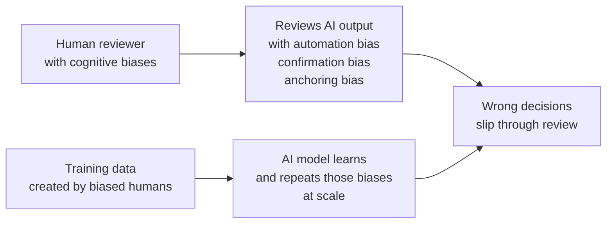
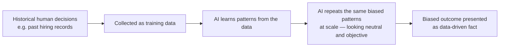

# Cognitive Biases and AI

---

## Learning Objectives

By the end of this topic, you should be able to:

- Explain what a cognitive bias is and why the human brain produces them
- Identify confirmation bias, anchoring bias, automation bias, and sunk cost bias in real-life and AI-related scenarios
- Describe how human biases end up embedded inside AI models through training data
- Differentiate between a human being biased while using AI versus an AI being biased because of its training data
- Evaluate a given AI-assisted decision scenario to spot which biases may be influencing the human reviewer

---

## Overview

You learned that System 1 thinking is fast but takes shortcuts. **Cognitive biases** are the predictable, repeated mistakes that come from those shortcuts. They are not signs of a bad or unintelligent person — every human brain has them, including highly experienced engineers and doctors.

Why does this matter for AI-native software? Because biases attack you from **two directions** at once:

- **Direction 1 — Bias in the human:** Biases affect how a human reviews AI output. For example, blindly trusting an AI's confident answer (automation bias), or only looking for evidence that confirms what you already believed (confirmation bias).

- **Direction 2 — Bias in the AI:** Biases get baked into the AI itself, because AI models learn from data that humans created — and human-created data carries human biases. If a hiring dataset historically favoured one type of candidate, an AI trained on that data will learn to repeat that pattern without anyone intending it to.

Recognising both directions is essential to responsible AI oversight. This topic gives you the vocabulary to name these failure patterns so you can catch them — in yourself, and in the systems you oversee.

---

## Confirmation Bias

**What it is:** Confirmation bias is the tendency to **search for, notice, and remember information that confirms what you already believe** — while ignoring or downplaying information that contradicts it.

**A familiar everyday example:**
Think about how Instagram or YouTube works. The moment you watch a few videos on a topic, the algorithm feeds you more of the same — and gradually your feed becomes an echo chamber of one viewpoint. But confirmation bias means you also actively participate in this: you click the videos you already agree with, skip the ones that challenge you, and come away feeling more certain than ever that your original view was right. This is confirmation bias in action — reinforced by an algorithm.

**In AI oversight:**
If you already suspect a customer is trying to commit fraud, and an AI fraud-detection tool flags their transaction as "suspicious," you may accept that flag immediately without checking the evidence — because it confirms what you already believed. If the same AI had said "not suspicious," you might have double-checked far more carefully. That inconsistency is confirmation bias. You are applying different levels of scrutiny depending on whether the AI agrees with you or not.

**The danger:** Once you "trust" an AI tool, confirmation bias makes you progressively less likely to notice when it is wrong — because you have stopped looking for its errors.

---

## Anchoring Bias

**What it is:** Anchoring bias is the tendency to **rely too heavily on the first piece of information you receive** — the "anchor" — even when later information should change your judgment.

**A familiar everyday example:**
You walk into a shop and see a jacket priced at $200, marked down from "$350." That $350 becomes your anchor — and $200 feels like a bargain, even if $200 is still expensive for that jacket. Your judgment locked onto the first number you saw, and everything else got measured against it.

**In AI oversight:**
If an AI assistant's first draft of a project estimate says the timeline is "8 weeks," everyone in the meeting anchors to that number. Even after new information arrives — a team member is leaving, a requirement has grown in scope — it becomes psychologically very hard to move away from 8 weeks. The AI's first output has set an invisible floor for the discussion, simply because it was seen first.

**The danger:** The AI does not know which number is "right" — it outputs what the patterns in its training data suggest. If that first output anchors a team to a wrong assumption, every subsequent decision builds on a flawed foundation.

---

## Automation Bias

**What it is:** Automation bias is the tendency to **trust the output of an automated system more than you would trust the same judgment from a human**, often without adequately verifying it.

**A familiar everyday example:**
Following a GPS instruction to turn down a road — even when you can see with your own eyes that the road is flooded or blocked — simply because "the app said so." The authority of the automated system overrides your own direct observation.

**In AI oversight:**
A radiologist who has reviewed 500 scans where an AI tool correctly flagged tumours may start rubber-stamping the AI's judgment on the 501st scan without looking as carefully — even though this is exactly the scan where the AI happens to be wrong. The more reliable the AI seems in general, the more dangerous automation bias becomes — because trust accumulates until the one time it shouldn't.

**Why it connects to System 1 and the fluency effect:**
Remember from the previous topic — a confident, fluent AI output triggers System 1 approval. Automation bias is what happens when that System 1 trust becomes a habit. You stop consciously deciding to trust the AI and start doing it automatically, even for decisions that demand System 2 verification.

---

## Sunk Cost Bias

**What it is:** Sunk cost bias is the tendency to **continue investing in something because of what has already been spent on it** — even when the evidence clearly suggests it is not working.

**A familiar everyday example:**
You have watched 45 minutes of a film and realised it is terrible. But you stay until the end anyway because "I've already come this far." The 45 minutes is a sunk cost — it is gone regardless of whether you stay or leave. Rational thinking says leave. Sunk cost bias says stay.

**In AI oversight — why this matters:**
A team spends six months building an AI-powered feature. Testing reveals the model's accuracy is too low to be useful. But six months of engineering effort feels like too much to abandon — so instead of admitting the system is not ready, the team lowers the pass threshold, adjusts the evaluation criteria, and ships it anyway.

This is one of the most common and most dangerous failure patterns in real AI deployments. The bias does not look like bias from the inside — it looks like "making the most of what we've built" and "not wasting all that work." But the result is an underperforming AI system reaching real users because the team could not separate their past investment from their current evidence.

**Why an evaluation plan prevents this:**
This is exactly why the evaluation plan from the previous topic must be written and agreed upon **before** building begins. Once you have committed to a threshold in advance, sunk cost bias cannot quietly move the goalposts after the fact.

---

## Comparison — The Four Biases

| Bias | What Happens | Simple Example | Risk in AI Systems |
|---|---|---|---|
| **Confirmation bias** | You favour evidence that agrees with your existing belief | Only noticing AI's correct answers, ignoring its mistakes | Reviewers stop looking for AI errors once they "trust" a tool |
| **Anchoring bias** | You over-rely on the first number or fact you saw | First price quoted feels like the reference point | First AI-generated draft becomes hard to correct later |
| **Automation bias** | You trust automated output more than you should | Blindly following GPS despite visible road closure | Humans stop double-checking AI decisions in high-stakes situations |
| **Sunk cost bias** | You continue because of what you've already invested | Staying till end of a bad film because you started it | Teams ship underperforming AI because they invested too much to stop |

---

## How Human Biases Get Encoded into AI Training Data

**The core idea:** An AI model learns patterns from the data it is trained on. If that data was created, labelled, or collected by humans — and it almost always was — then whatever biases existed in that human process get absorbed into the model's learned patterns.

**How this happens, step by step:**

**Step 1 — Data collection reflects historical human decisions**
For example, a company's past hiring records reflect the decisions of human hiring managers — including any unfair patterns those managers had, consciously or not.

**Step 2 — The AI model looks for patterns in that data**
It does not know *why* certain candidates were hired more often. It just learns: "these patterns predict a successful hire."

**Step 3 — The AI repeats those patterns at scale**
If the training data quietly favoured graduates from certain universities, or candidates with certain names, the model learns to replicate that pattern — even without anyone explicitly telling it to consider those factors.

**Step 4 — The result looks neutral but is not**
Because the AI is doing statistics, its biased output can appear objective and data-driven — which makes it more convincing, and more dangerous, than an obviously biased human opinion. The numbers give it an air of authority it does not deserve.

**The important distinction:**
- A human being biased **while using AI** = the human's own cognitive bias affects how they review or act on AI output (automation bias, confirmation bias, anchoring bias)
- An AI being biased **because of training data** = the model learned unfair patterns from historical human decisions and now replicates them

Both happen simultaneously in real AI systems. The resume screening example below shows exactly how they combine.

---

## Best Practices

- Always ask: "Whose past decisions does this training data represent — and could those decisions have been biased?"
- When reviewing AI output in a high-stakes area (hiring, lending, healthcare), specifically look for patterns that might reflect encoded historical bias — do not assume "the AI is just doing maths, so it must be fair"
- Use diverse review teams — one person's blind spot is often another person's obvious red flag
- If you catch yourself thinking "we've come too far to change course now" — that is sunk cost bias speaking. Separate the past investment from the current evidence and make the decision on its own merits

## Common Beginner Mistakes

- **Assuming AI is automatically objective** because it uses numbers and data — data is a reflection of human history, and history is not always fair
- **Confusing "the AI seems confident" with "the AI is unbiased"** — confidence and fairness are completely unrelated
- **Believing bias only comes from the AI model** — in practice, most real AI failures involve both a biased dataset *and* a human reviewer with automation bias failing to catch it
- **Only looking for bias in the training data** while ignoring the biases the human reviewer brings to the evaluation process

---

## Worked Example — AI Resume Screening

**Scenario:** A company's HR team uses an AI-powered resume screening tool to shortlist candidates for a software engineering role.

**Step 1 — Automation bias in action:**
The HR executive sees the AI has shortlisted 20 out of 200 resumes and, trusting the tool, sends interview calls without reviewing the rejected 180.
> "The system did the analysis — no need to double-check."

**Step 2 — Confirmation bias in action:**
When asked to spot-check a few rejected resumes, the HR executive picks ones that "look weak on paper" — subconsciously looking for evidence that supports the AI's rejection, rather than actively looking for cases where the AI may have made a mistake.
> "See — these rejections look right. The AI did a good job."

**Step 3 — Anchoring bias in action:**
The first resume reviewed had a well-known university's name on it and was immediately shortlisted. Every later resume gets subconsciously compared to that "anchor" resume — even when other candidates have stronger, more relevant project experience from lesser-known institutions.
> "They went to a top university — that's the benchmark."

**Step 4 — Encoded bias discovered:**
On investigation, the AI tool was trained on the company's last five years of "successful hires" — which happened to be dominated by graduates from a handful of well-known universities, because that is who the company hired before. The AI learned "resumes like these get hired" and is now silently repeating that historical pattern at scale.

**The conclusion:**
Three separate human biases (automation, confirmation, anchoring) combined with one data-driven bias (encoded historical pattern) to produce a resume-screening process that looks "data-driven and fair" but is actually neither. Catching this requires deliberately naming and checking for each failure point — which is exactly what this topic has given you the vocabulary to do.

---

## Real Cases

These are verified, real-world incidents that directly prove the concepts in this topic are not hypothetical:

**Amazon's AI hiring tool — the resume screening worked example, made real:**
Amazon built and then scrapped an AI recruiting tool after discovering it was systematically downgrading resumes from women. The tool had been trained on a decade of the company's past hiring data — which was male-dominated. It learned "resumes like these get hired" and replicated that bias at scale. This is exactly the scenario described in the worked example above.
> 📎 [Amazon ditched AI recruitment software because it was biased against women — MIT Technology Review (2018)](https://www.technologyreview.com/2018/10/10/139858/amazon-ditched-ai-recruitment-software-because-it-was-biased-against-women/)

**Automation bias in medical AI — peer-reviewed evidence:**
A systematic review published in the Journal of the American Medical Informatics Association documented that automation bias — the tendency to over-rely on automated systems — is a consistently observed phenomenon across medical settings. Clinicians shown AI recommendations showed reduced critical scrutiny compared to making decisions independently, even when the AI was wrong.
> 📎 [Automation bias: a systematic review — Journal of the American Medical Informatics Association (2012)](https://doi.org/10.1136/amiajnl-2011-000089)

---

## Key Takeaways

- A **cognitive bias** is a predictable mental shortcut — not a sign of low intelligence, but a universal feature of human thinking
- **Confirmation bias** = favouring evidence that agrees with what you already believe
- **Anchoring bias** = over-relying on the first piece of information received
- **Automation bias** = trusting automated AI output more than you would trust the same judgment from a human, often without verifying it
- **Sunk cost bias** = continuing to invest in something because of what has already been spent, even when evidence says stop
- AI training data reflects historical human decisions — any bias in those past decisions gets absorbed and repeated by the AI model, often invisibly
- Data-driven output can feel objective while still being biased — statistics do not automatically remove human unfairness
- Bias attacks from two directions simultaneously — in the human reviewer and in the AI model itself. Both must be checked

> **Interview tip:** Being able to name a specific bias — not just say "AI can be biased" — shows a much deeper, professional understanding of AI risk. Even stronger: being able to explain how the same situation involves multiple biases at once, as the resume screening example shows.

---

## Reference Links

- 📎 [Daniel Kahneman — Thinking, Fast and Slow](https://www.amazon.com/Thinking-Fast-Slow-Daniel-Kahneman/dp/0374533555) — foundational source on cognitive biases and heuristics
- 📎 [NIST AI Risk Management Framework](https://www.nist.gov/itl/ai-risk-management-framework) — Map function specifically addresses identifying bias risks in AI systems
- 📎 [Google Machine Learning Crash Course — Fairness](https://developers.google.com/machine-learning/crash-course/fairness) — practical grounding in how bias enters ML systems through data
