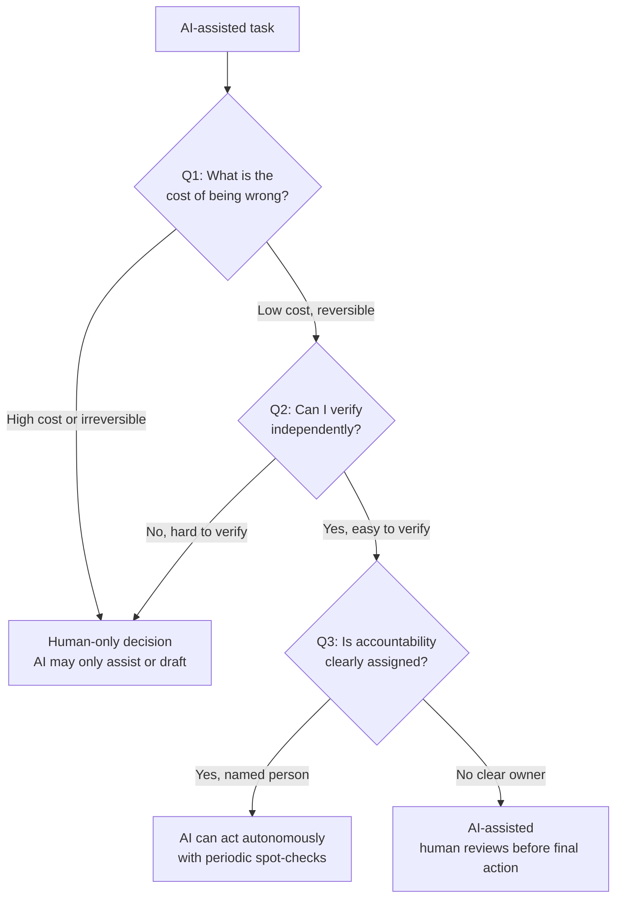

# The Judgment Framework

---

## Learning Objectives

By the end of this topic, you should be able to:

- Explain the purpose of the Judgment Framework and why it exists as a structured decision tool
- Describe each of the three questions in the framework and what it is designed to reveal
- Apply the Judgment Framework to a real AI-system scenario to decide the right level of human oversight
- Differentiate between situations suited to fully autonomous AI, AI-assisted human decisions, and human-only decisions
- Evaluate a proposed AI feature and justify, using the framework, how much human oversight it needs

---

## Overview

You now know that human thinking has two speeds and that both speeds — and the AI systems built on human data — are vulnerable to predictable biases. The natural next question is: **how much should a human check an AI's work, and when?**

Checking everything an AI does, all the time, defeats the purpose of using AI at all — you would spend as much effort verifying as you would have spent just doing the task yourself. But checking nothing is how real, documented AI failures happen.

The **Judgment Framework** is a simple three-question tool that helps you decide, for any AI-assisted task, exactly how much human oversight is appropriate. Every time you build, specify, or use an AI system, you can run it through these three questions to decide: should this run fully automatically, should a human review it before it is final, or should a human make the decision entirely with AI only assisting?

**Think of it like a doctor deciding what to do next:**
A patient walks in with a headache. The doctor does not prescribe morphine immediately (too costly if wrong). They do not just tell the patient to go home without checking anything (no verification). And they do not just blame "the system" if something goes wrong — they are the accountable professional. The doctor instinctively runs three questions: how serious could this be? Can I verify what is happening? Who is responsible for the outcome? That is exactly the Judgment Framework.

---

## The Three Questions

### Q1 — What Is the Cost of This Being Wrong?

This question asks you to imagine the worst case if the AI's output is wrong and nobody catches it.

Ask yourself:
- What is lost — money, time, health, reputation, safety, legal standing?
- Is the mistake **reversible** (easy to undo) or **irreversible** (cannot be undone)?

**Reversible mistake example:** An AI recommends a wrong movie in a "you might also like" list. The user ignores it, watches something else. No harm done. Easy to undo — just scroll past it. This is low cost.

**Irreversible mistake example:** An AI wrongly approves a $50,000 loan for a fraudulent applicant. The money is transferred. By the time the error is caught, it may never be recovered. This is high cost and hard to reverse.

The key test: **if no one catches this mistake for a week, what is the damage?** A low-cost mistake causes minor inconvenience. A high-cost mistake causes real, lasting harm.

---

### Q2 — Can I Verify This Without the AI?

This question asks whether a human — or another independent system — can check the AI's answer using a source that does **not** depend on the AI itself.

**What independent verification actually looks like:**
- Checking an AI-generated account balance against the bank's own ledger record — the ledger exists independently of the AI
- Checking an AI-drafted customer reply against the company's official refund policy document — the policy exists independently
- A doctor cross-checking an AI diagnosis suggestion against the patient's lab results and medical history — the records exist independently

**What independent verification does NOT look like:**
- "The AI said 95% confident, so it is probably right" — this is trusting the AI to verify itself
- "The AI has been right about this kind of thing before" — past accuracy is not independent verification of this specific output
- "I read the AI's answer and it sounded correct" — reading is System 1; verification requires checking against an independent source

**Easy to verify:** "What is the current balance on this account?" — check the bank ledger. Done.

**Hard to verify:** "Will this patient's condition worsen in the next 48 hours?" — no simple independent check exists. Requires deep medical expertise and judgment. The AI cannot be its own verifier here.

---

### Q3 — Who Is Accountable If This Fails?

This question asks: if the AI's decision turns out to be wrong and causes harm, **whose name is on it?**

Is there a clearly identified human or role responsible for the outcome — legally, professionally, or ethically? Or does accountability disappear into "the algorithm did it"?

**Clear accountability example:**
A loan officer reviews and digitally signs off on an AI-suggested loan decision before it is executed. If that loan later defaults in suspicious circumstances, the loan officer is the accountable party.

**Missing accountability example:**
An AI auto-rejects loan applications with no human sign-off at all. If this is later found to be unfairly biased against certain applicants, who is responsible? The engineering team who built it? The product manager who approved it? Nobody? This accountability gap is itself a governance failure — and it is exactly what regulations like the EU AI Act are designed to prevent.

**The test:** Can you write a specific job title next to "accountable for this AI decision"? If the answer is "well, the AI decided it" — that is not accountability. That is a gap.

---

## How the Three Questions Work Together

**A low cost task with no accountable owner can still be dangerous.** Imagine an AI automatically translating customer feedback into English across a global platform — millions of translations per day. Each individual wrong translation is low cost. But if no one is accountable for checking translation quality, and the translations are systematically biased against certain languages or dialects, the accumulated harm across millions of users is significant. Q1 alone would have said "low risk." Q3 reveals the real problem.

**"The AI is usually right" never answers Q2.** Statistical accuracy is not independent verifiability. A model that is right 95% of the time cannot verify its own 5% of errors. You need a source that is independent of the model to catch those.

**Accountability requires a specific named role, not a vague human presence.** "A human will be somewhere in the loop" is not accountability. The question is: which human, by name or by job role, is signing their professional credibility to this decision?

**The three questions are the direct antidote to the three biases:**

- **Q1 counters anchoring bias** — instead of anchoring to the AI's first output and assuming it is good enough, you are forced to ask: what is the worst case if this is wrong? That question breaks the anchor before it forms
- **Q2 forces you out of automation bias** — instead of trusting the AI's confident output, you must identify an independent source to verify it against. This is System 2 engagement made structural — not optional, not up to the individual reviewer on that day
- **Q3 closes the accountability gap** — by requiring a named, accountable human before deployment, it removes the "the algorithm did it" escape that automation bias and confirmation bias together create

### Where Different Tasks Land

| Task | Q1: Cost of Wrong | Q2: Verifiable Independently? | Q3: Accountability Clear? | Framework Outcome |
|---|---|---|---|---|
| AI recommends a film or product | Very low | Not needed | Not needed | Fully autonomous ✅ |
| AI drafts a customer support reply | Low–medium | Yes — check against policy docs | Support agent reviews before sending | AI-assisted, human-reviewed |
| AI approves or denies a loan | High, hard to reverse | Yes — financial records exist | Must be a named loan officer | AI-assisted, human sign-off required |
| AI suggests a medical diagnosis | Very high, life-affecting | Only by expert judgment | Must be a licensed doctor | Human-only decision — AI is advisory only |

> **Re-apply whenever scope changes.** A chatbot that only answered FAQs yesterday but is being expanded to authorise refunds today needs to be run through all three questions again. Oversight needs usually increase as capability increases — never assume last year's answers still apply.

**What "periodic spot-checks" actually means:**

When the framework says "AI can act autonomously with spot-checks," that is not a vague reassurance — it is a specific, scheduled practice. A spot-check means: randomly sample a defined percentage of the AI's outputs (typically 3–10%), have a human verify each sampled output against an independent source, and record the results. If the error rate in the sample crosses a predefined threshold, the system gets flagged for review.

For example: an AI that auto-categorises customer support tickets could be allowed to run autonomously, with a team member randomly reviewing 5% of categorisations each week against the actual ticket content. If more than 10% of the sampled categorisations are wrong, the team investigates before the next week's batch runs. This is not optional — it is the oversight mechanism that makes autonomous operation responsible rather than just convenient.

---

## Best Practices

- Apply all three questions together — a task might look low-risk on Q1 but fail badly on Q3 (no accountable owner), which still means it needs stronger oversight
- Document your answers to all three questions when designing an AI feature — this becomes evidence of responsible design
- Revisit the framework whenever an AI system's scope grows
- When in doubt between "AI-assisted" and "human-only" — err toward more human oversight, not less

## Common Beginner Mistakes

- **Only asking Q1 and skipping Q2 and Q3** — a low-cost individual error can accumulate into a large-scale problem when it happens millions of times with no one accountable for catching it
- **Treating "the AI is usually right" as an answer to Q2** — statistical accuracy is not independent verifiability. You need a source that exists outside the AI to catch the errors the AI cannot see in itself
- **Assuming "a human is somewhere in the loop" satisfies Q3** — accountability requires a specific, named responsible role, not a vague human presence
- **Forgetting to re-run the framework when scope expands** — this is called scope creep, and it is one of the most common real AI deployment failures. A customer support chatbot is approved to answer FAQs (low cost, easy to verify, clear accountability). Six months later, someone quietly adds the ability to issue refunds up to $100. The framework was never re-run. Now a system approved for low-stakes work is making financial decisions it was never evaluated for. If those refund decisions turn out to be biased or incorrect, who is accountable? Nobody checked.

---

## Worked Example — College Admissions Shortlisting

**Scenario:** Your team is designing an AI feature for a college's admissions portal — an AI assistant that shortlists applicants for interview based on their application forms.

**Q1 — What is the cost of being wrong?**

If the AI wrongly rejects a genuinely strong candidate, that student loses a fair shot at admission — a real, hard-to-reverse harm to an individual's opportunity and future.

> **Answer: High cost. Hard to reverse.**

**Q2 — Can I verify this without the AI?**

Yes, partially. A human admissions officer can review the original application form independently and check whether the AI's shortlisting decision matches what a human evaluator would decide. But full re-evaluation of every applicant defeats the purpose of using AI.

> **Answer: Verifiable through deliberate spot-checks — but not automatically for every case.**

**Q3 — Who is accountable if this fails?**

If a wrongly rejected student later complains or appeals, the college needs a named admissions officer — not "the AI system" — who reviewed and approved the shortlist.

> **Answer: Accountability must be explicitly assigned to a named human role.**

**Framework Outcome:**

This is not a candidate for a fully autonomous AI decision. Given the high cost (Q1) and the need for a clearly accountable human decision-maker (Q3), the correct design is:

> **AI pre-scores and ranks applicants. A human admissions committee makes the final shortlist decision. Borderline cases are always escalated to human review with a documented process.**

The AI does the heavy lifting. The human makes the call. The accountability is clear.

---

## Key Takeaways

- The **Judgment Framework** is a three-question tool to decide how much human oversight an AI-assisted task needs
- **Q1 — Cost of being wrong:** how bad is it, and is it reversible?
- **Q2 — Can I verify independently:** is there a way to check the AI's answer without trusting the AI itself?
- **Q3 — Who is accountable:** is there a specific, named human responsible if it fails?
- Low cost + easy to verify + clear accountability → AI can often act autonomously with spot-checks
- High cost, hard to verify, or unclear accountability → a human must be in the loop, sometimes as the final decision-maker
- Apply all three questions together — a task that looks safe on one question can fail badly on another
- Re-apply the framework whenever an AI feature's scope, scale, or stakes change

> **Interview tip:** Being able to walk through all three questions for a real feature — like the college admissions example — demonstrates mature, production-ready AI judgment. Most candidates say "I'll add a human review step." You can now explain exactly when that is necessary, when it is not, and why — with a structured, defensible reasoning process.

---

## Reference Links

- 📎 [NIST AI Risk Management Framework](https://www.nist.gov/itl/ai-risk-management-framework) — Govern and Manage functions map closely onto accountability and oversight concepts in this framework
- 📎 [EU AI Act — Official Text](https://eur-lex.europa.eu/legal-content/EN/TXT/?uri=CELEX%3A32024R1689) — Article provisions on human oversight for high-risk AI systems, directly relevant to Q3
- 📎 [Google Machine Learning Crash Course — Responsible AI](https://developers.google.com/machine-learning/crash-course) — practical grounding in designing oversight into AI-powered products
