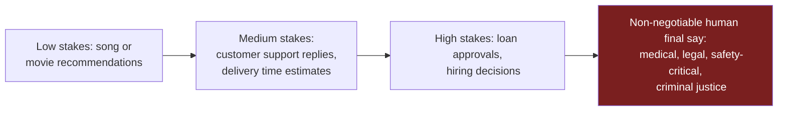

# Defining Safe Boundaries

---

## Learning Objectives

By the end of this topic, you should be able to:

- Explain what "acceptable error" means in plain, everyday language
- Give examples of situations where a wrong AI answer is a minor annoyance versus a serious problem
- List the domains where an AI should never be allowed to make the final decision on its own
- Explain why "the AI is 95% accurate" does not automatically mean "the AI is safe to use here"
- Describe what a human checkpoint looks like in a real system, and why it must be built in — not just promised

---

## Overview

Every AI system makes mistakes. Not "might" — will. No matter how well it is built, there will always be some percentage of the time when it gets things wrong. This is simply a fact of how these systems work, and no amount of extra training removes it completely.

So the real question isn't "How do we build an AI that never makes mistakes?" That question has no answer. The real question is: **"How wrong is too wrong for this particular task — and who is allowed to make the final call?"**

This is not a technical question. It is a judgment call that a team of humans has to make deliberately, before the AI ever goes live — not something they discover by accident after a customer gets hurt.

---

## Acceptable Error — How Much Wrong Is Okay?

**In plain terms:** Acceptable error is the line a team draws, in advance, that says: "Below this level of mistakes, the AI is still fine to use for this job. Above this level, it is not."

**Why this matters:** Not all mistakes are equal. Think about the difference between these two situations:

- A music app recommends a song you don't like. You skip it. Nothing bad happened.
- A GPS app tells a truck driver a bridge can handle their vehicle's height, and it can't. That mistake can total the truck — or worse.

Same idea — "the AI got it wrong" — but wildly different consequences. That's why there is no single "acceptable error rate" that applies to every AI system. It has to be decided case by case.

**Four questions every team should ask before launching an AI feature:**

1. What does "wrong" actually mean here? (A late reply? A wrong number? A missed warning?)
2. If the AI gets it wrong, what actually happens to the person on the other end?
3. How good are humans at this task already? (The AI doesn't need to be perfect — often it just needs to be at least as good as the human process it's replacing.)
4. How will anyone even notice if the AI starts making more mistakes than expected, once it's live?

**A simple, relatable example:**
A food delivery app (think Uber Eats, DoorDash, or Zomato) builds an AI to predict delivery times. The team decides: *"We'll count this as acceptable if the estimate is within 10 minutes of the real delivery time, at least 9 times out of 10."* That's a clear, testable line. Compare that to a vague goal like "make the estimates pretty accurate" — which can't be tested or enforced at all.

---

## High-Stakes Domains — Where AI Should Never Have the Final Word

**In plain terms:** In some areas of life, a wrong decision can't just be shrugged off. It can permanently damage someone's health, freedom, money, or safety. In those areas, no error rate is ever low enough to hand the AI the final decision, unsupervised. A human must always check, confirm, or be able to override the AI before it takes effect in the real world.

**Why these are different:** If a shopping app recommends the wrong shoe size, you return it. If a hiring algorithm rejects a qualified candidate and no human ever reviews it, that person may lose a job opportunity they never even knew they were unfairly denied. One mistake is annoying. The other can change someone's life.

**Domains where a human must always stay in charge of the final call:**

| Domain | Example of AI's Role | Why AI Can't Have the Final Word |
|---|---|---|
| **Medical** | AI flags a possible tumor in a scan | A missed or wrong call can cost a life; only a licensed doctor is accountable for treatment decisions |
| **Legal** | AI drafts a contract clause or predicts a case outcome | Legal outcomes can affect someone's freedom, rights, or finances for years; a qualified lawyer or judge must decide |
| **Safety-Critical Systems** | AI controls a self-driving car or factory machinery | A malfunction can cause physical injury or death; a human override must always be possible |
| **Criminal Justice** | AI risk-scores a person for bail or sentencing | Directly affects someone's liberty; these tools have a documented history of encoding bias |
| **Large Financial Decisions** | AI auto-approves a large loan or investment | Financial harm at scale is hard to reverse; regulators generally require a human to be accountable |

**A simple way to picture where the line sits:**

> **Important:** "AI can't have the final word" does **not** mean "AI is banned from these areas." AI can still draft, suggest, summarize, or flag things for attention. It just can never be the last checkpoint before a real-world action happens. This is the same principle behind why airplanes have autopilot *and* a pilot who can take back control at any moment.

---

## Best Practices

- Write down the acceptable error threshold for any AI feature **before** it's built — not after something goes wrong
- For high-stakes domains, design the system so the human checkpoint is physically built into the process — not just a step someone is "supposed to" remember to do
- Revisit your acceptable error threshold regularly. What was fine for a small pilot test of 50 users may not be fine once a million people are using it

## Common Beginner Mistakes

- **Assuming "high accuracy" automatically means "safe."** Even a 95%-accurate system still gets 1 in 20 people the wrong outcome — completely unacceptable at scale in something like healthcare or criminal justice
- **Treating "a human is in the loop" as a checkbox**, rather than genuinely designing what the human actually reviews, how much time they're given, and whether they have real authority to override the AI
- **Forgetting that "no error is acceptable" domains still need a clear error threshold for the AI's *supporting* role** — for example, how accurate does the AI's suggestion need to be before it's even a useful starting point for the doctor or lawyer reviewing it?

---

## Worked Example — An AI Symptom Checker

**Scenario:** A healthcare startup builds an AI chatbot that lets users type in their symptoms and get a suggested next step (e.g., "see a doctor urgently," "this is likely minor," "monitor for 24 hours").

**Step 1 — Define acceptable error:**
The team decides the AI must correctly flag at least 98% of *serious* cases as "seek care urgently." Missing a serious case is far more dangerous than telling someone with a minor issue to see a doctor unnecessarily — so they deliberately accept more false alarms in exchange for almost never missing something dangerous.

**Step 2 — Classify the domain:**
This is a medical, high-stakes domain — no question about it.

**Step 3 — Apply the "no final word" rule:**
No matter how well the chatbot performs against its 98% target, it is never allowed to tell a user "you definitely have condition X" or "you definitely don't need to see anyone." It can only suggest urgency levels and always recommends confirming with an actual clinician for anything beyond basic self-care advice.

**Step 4 — Design the checkpoint:**
Every "urgent" flag from the chatbot includes a direct next step: book a same-day appointment or call a nurse hotline — a real human, not just a warning message the user can dismiss and forget.

**Conclusion:** A 98%-accurate chatbot still isn't allowed to make the final call. The acceptable-error threshold decides *how good the AI needs to be to be useful*. The high-stakes-domain rule separately decides *who is allowed to make the final decision*. Both matter, and they're not the same thing.

---

## Real Cases

These are real, documented incidents that show what happens when this principle is ignored.

**IBM Watson for Oncology:**
IBM built an AI system meant to help doctors choose cancer treatments. Internal reviews later found that in some cases, the system had recommended treatments that were unsafe or incorrect — reportedly because it had been trained on a limited set of hypothetical cases rather than enough real patient data. Hospitals that had planned to lean on it heavily for treatment decisions scaled back its role sharply once these issues became known.
> 📎 [IBM's Watson gave unsafe recommendations for cancer treatment — STAT News](https://www.statnews.com/2018/07/25/ibm-watson-recommended-unsafe-incorrect-treatments/)

**The COMPAS algorithm — automation bias in criminal justice:**
COMPAS is a risk-assessment tool used by several U.S. courts to help predict whether a defendant is likely to reoffend, used to inform bail and sentencing decisions. A major investigation found the tool was significantly more likely to incorrectly flag Black defendants as high risk compared to white defendants with similar records. Because judges in some cases leaned on the score without enough independent scrutiny, a flawed algorithm was quietly influencing decisions about people's freedom.
> 📎 [Machine Bias — ProPublica](https://www.propublica.org/article/machine-bias-risk-assessments-in-criminal-sentencing)

---

## Key Takeaways

- **Acceptable error** is the maximum amount of mistakes a system is allowed to make for a specific job — decided deliberately in advance, not discovered after a failure
- The same "wrong answer" can be trivial (a bad song recommendation) or dangerous (a missed medical warning) — that's why the acceptable threshold is different for every use case
- **High-stakes domains** — medical, legal, safety-critical, criminal justice, large financial decisions — should never let an AI make the final, unsupervised call, no matter how accurate it is
- A high accuracy number (like 95%) is **not** the same as "safe for high-stakes use" — at scale, even small error rates become real harm to real people
- AI can still help in high-stakes areas — draft, flag, summarize, suggest — the rule is about **who gets to decide**, not whether AI is allowed to be involved at all
- Build the human checkpoint into the system itself. Don't rely on someone remembering to do it

> **Interview tip:** If you're asked "how would you decide if an AI feature is safe to launch?", answering with a concrete acceptable-error threshold plus a clear human-checkpoint design (rather than a vague "we'll be careful") is exactly the kind of answer that stands out.

---

## Reference Links

- 📎 [NIST AI Risk Management Framework](https://www.nist.gov/itl/ai-risk-management-framework) — covers how organizations set and monitor acceptable risk/error thresholds
- 📎 [EU AI Act — Official Text](https://artificialintelligenceact.eu/) — legal obligations for "high-risk" AI systems in healthcare, legal, and safety-critical settings
- 📎 [Google Machine Learning Crash Course — Classification: Thresholding](https://developers.google.com/machine-learning/crash-course/classification/thresholding) — the technical basis for how error thresholds are tuned in real ML systems
- 📎 [Machine Bias — ProPublica](https://www.propublica.org/article/machine-bias-risk-assessments-in-criminal-sentencing) — real-world investigation into AI in criminal sentencing
