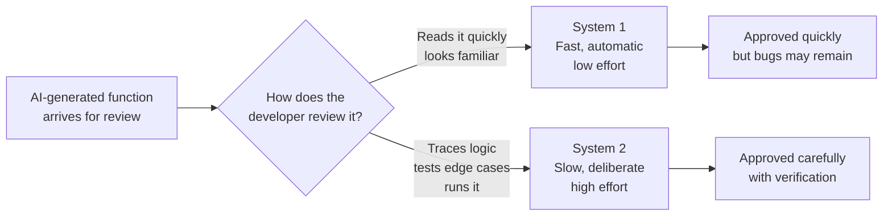

# How Humans Think

---

## Learning Objectives

By the end of this topic, you should be able to:

- Explain the difference between System 1 and System 2 thinking in the human brain
- Identify everyday situations where you are using System 1 versus System 2 thinking
- Describe why System 1 thinking makes humans fast but occasionally error-prone
- Differentiate between tasks that are safe to leave to instinct and tasks that demand deliberate, slow thinking
- Explain why understanding your own thinking process is the first step before you can responsibly oversee an AI system's output

---

## Overview

Before we can talk about how humans should oversee AI systems, we need to understand how the human brain itself makes decisions. This might feel like a strange place to start in a program about AI — but it is deliberate.

The single biggest risk in AI-native software is not the AI being wrong. It is a **human reviewer approving a wrong AI answer without noticing**, because their own brain took a shortcut.

Imagine a developer using an AI coding assistant — like GitHub Copilot — to generate functions for a payment processing feature. The AI produces code quickly and confidently. The developer reviews each function before committing it to the codebase. This sounds safe — a human is in the loop. But whether that developer actually catches a mistake depends entirely on how their brain is working at that moment.

Psychologist and Nobel Prize winner Daniel Kahneman showed that our brain runs on **two very different thinking systems** — one fast and automatic, one slow and effortful. Both are useful. Both are also, in different ways, unreliable if used in the wrong situation. Understanding which mode your brain is in — and when to switch — is one of the most important skills in this program.

---

## System 1 Thinking — Fast, Instinctive, Automatic

**System 1** is the part of your thinking that works **automatically, quickly, and with very little effort**. It runs constantly in the background, without you consciously choosing to turn it on.

**Why it exists:**
Evolution favoured fast thinking because, for most of human history, slow thinking could get you killed. If you saw a shadow that looked like a snake, you jumped back immediately — you did not sit down and calculate the probability that it was actually a snake. System 1 is your brain's shortcut system, built for speed and survival, not for perfect accuracy.

**In the code review context:**
The developer opens a new AI-generated function. The structure looks familiar — correct indentation, recognisable variable names, clean logic. Within a few seconds, System 1 signals "this looks right" and the developer clicks approve. They did not run the code. They did not trace what happens when the input is zero or negative. The function looked correct at a glance — and that glance was System 1.

**Everyday examples:**
- Recognising a friend's face in a crowd — you just know, without processing feature by feature
- Reacting to a car horn while crossing the road — your body moves before your brain consciously decides to
- Reading the word "STOP" on a sign — the meaning arrives instantly, you do not sound out each letter
- Answering "2 + 2 = ?" — you do not calculate, you simply know

**Key properties:**

| Property | System 1 |
|---|---|
| Speed | Near-instant |
| Effort | Very low — feels automatic |
| Awareness | Usually unconscious |
| Reliability | Good for familiar, repeated patterns — unreliable for new or complex situations |
| Risk | Takes shortcuts that can lead to errors and biases |

---

## System 2 Thinking — Slow, Deliberate, Effortful

**System 2** is the part of your thinking that engages **deliberately, slowly, and with conscious effort**. You switch it on when a situation demands careful reasoning.

**Why it exists:**
Some problems cannot be solved by instinct. They require holding multiple pieces of information in mind at once, comparing options, and reasoning step by step. System 2 is slower and more tiring — but it is far more accurate for unfamiliar or high-stakes problems.

**In the code review context:**
A System 2 review of the same AI-generated function looks completely different. The developer does not just read the code — they mentally trace execution. They ask: "what happens if someone passes in 0 as the order amount? What if the input is negative? What if the list is empty?" They run the function against a few test inputs. They check whether the return type matches what the next function in the pipeline expects.

This takes ten minutes instead of thirty seconds. But it is what actually catches bugs — not the visual scan.

**Everyday examples:**
- Solving 47 × 36 in your head without a calculator
- Carefully reading a rental agreement before signing it
- Deciding which job offer to accept by comparing salary, growth, location, and culture
- Debugging code line by line to find why it produces the wrong output



**Comparison — System 1 vs System 2:**

| Aspect | System 1 | System 2 |
|---|---|---|
| Speed | Instant | Slow |
| Mental effort | Very low | High |
| Awareness | Unconscious | Conscious and deliberate |
| Best suited for | Familiar, repeated, low-stakes decisions | Unfamiliar, complex, high-stakes decisions |
| Risk | Prone to shortcuts and biases | Mentally tiring — your brain avoids it unless forced |
| In code review | Reading the code and approving because it looks right | Tracing the logic, testing edge cases, running it |

---

## The Hidden Danger — Defaulting to System 1

You cannot run on System 2 all day — it is mentally exhausting. So your brain naturally tries to solve as many things as possible using System 1, even when it should not.

For the developer reviewing AI-generated code, the danger builds gradually. The first function of the day gets careful System 2 attention — every line traced, every edge case considered. By the tenth function, the brain is in a rhythm. The code starts to look familiar. System 1 takes over. The developer is reading, not verifying.

This tendency to default to System 1 is exactly what causes **automation bias** — trusting an AI's output without actually checking it.

**Decision fatigue — why the fifteenth review is more dangerous than the first:**

Every time you engage System 2, it uses mental energy. The more reviews you do in a row, the more depleted that energy becomes — and the more your brain compensates by switching to System 1. This is called **decision fatigue**.

A developer reviewing fifteen AI-generated functions in one afternoon will give the last few far less scrutiny than the first. Not because they are lazy — but because System 2 capacity is finite. The brain starts approving by pattern recognition instead of by verification.

This is why important code reviews — especially for AI-generated code touching payments, authentication, or data storage — should not be crammed into a long unbroken session. Reviewing in shorter batches with breaks maintains the System 2 engagement that catches real bugs.

---

## Why Clean AI Code Feels Correct

Here is the mechanism that makes this especially dangerous with AI-generated code:

AI coding assistants produce code that is well-structured, correctly indented, uses sensible variable names, and follows recognisable patterns. It looks professional. It reads cleanly. And that visual cleanliness triggers System 1 approval before any logic has actually been verified.

This phenomenon has a name: the **fluency effect**. When something is easy to read and well-structured, our brain automatically rates it as more credible — regardless of whether it is actually correct. A beautifully written function with a subtle edge-case bug is far more dangerous than messy code with the same bug — because the clean presentation disarms System 1 scrutiny.

This is the precise mechanism by which AI-generated bugs slip through human review. The code is not hard to read — it is easy. And that ease of reading is exactly what makes it dangerous.

Responsible code review means **consciously engaging System 2**: not just reading the code, but tracing execution, testing inputs, and verifying behaviour — even when the code looks fine at a glance.

The moment a developer catches themselves thinking "looks good, approve" without running a single test — that is System 1 taking over. That is the moment a bug is most likely to reach production.

---

## Best Practices

- Before approving any AI-generated code, consciously ask: "Am I reviewing this with System 1 (reading) or System 2 (actually tracing and testing)?"
- For code that touches payments, user data, authentication, or critical logic — always run it against at least one edge case before approving. Reading is System 1. Running is System 2
- Build habits that force System 2 engagement — write down the edge cases you will test before opening the code, so testing becomes part of the review flow rather than an afterthought
- Be aware of decision fatigue: after reviewing many AI-generated functions in a row, take a break before continuing. System 2 capacity is not unlimited — the quality of your review degrades as the session lengthens

## Common Beginner Mistakes

- **Assuming "I read the code" means "I reviewed it"** — reading is often System 1. Reviewing requires System 2 verification — tracing logic, testing inputs, checking edge cases
- **Believing System 1 is bad and System 2 is good** — both are necessary. The skill is knowing when to use which one
- **Underestimating how convincing clean AI code feels** — well-structured, properly indented code triggers System 1 approval almost automatically. This is exactly why bugs in clean AI-generated code are harder to catch than bugs in messy human-written code

---

## Worked Example — AI-Generated Payment Processing Function

**Scenario:** A developer is reviewing an AI-generated function that calculates the total price of items in a shopping cart, including a 10% discount for orders above $100.

**The AI generated:**

```python
def calculate_total(cart_items):
    subtotal = sum(item['price'] for item in cart_items)
    if subtotal > 100:
        subtotal = subtotal * 0.9
    return subtotal
```

**System 1 review (fast, instinctive):**
"Clean code. Loops through items, calculates subtotal, applies discount if over $100. Looks correct — approve."
*(Takes 10 seconds, no testing.)*

**System 2 review (slow, deliberate):**
1. What happens if `cart_items` is an empty list? → `sum()` of an empty list returns 0. Function returns 0. Acceptable — no crash.
2. What happens if an item's `price` key is missing? → `KeyError` — the function crashes. The AI never handled missing data.
3. What if `subtotal` is exactly $100? → `100 > 100` is False — no discount applied. But the spec said "orders above $100" — so $100 exactly should not get the discount. Actually correct, but worth confirming with the spec.
4. What if a price is negative (a return or credit)? → The subtotal could become negative. The discount condition might behave unexpectedly. The spec never addressed this.

**What the System 2 review discovers:**
The function crashes on any cart item that is missing a `price` key — a real production scenario when a data entry error or API response is malformed. The AI never added any input validation.

**The outcome:**
System 1 would have approved and committed a function that crashes in production whenever a cart item has missing data — silently breaking the checkout flow for real customers.

System 2 caught the missing key error in two minutes. The developer added a validation check before deploying.

This is why the golden rule exists — never approve code you have not actually traced and tested, no matter how clean it looks.

---

## Real Cases

**Medical diagnostic errors caused by fast thinking:**
A peer-reviewed study documented how System 1 shortcuts — pattern-matching too quickly without verification — are a leading cause of diagnostic errors in medicine. Doctors who relied on first impressions without engaging System 2 missed conditions that slower, deliberate review would have caught. The parallel to code review is direct: both involve a confident, well-presented output that the reviewer must verify rather than simply accept.
> 📎 [Cognitive interventions to reduce diagnostic error — BMJ Quality & Safety (2012)](https://pubmed.ncbi.nlm.nih.gov/22543420/)

**Air France Flight 447 — automation bias in aviation:**
In 2009, Air France Flight 447 crashed into the Atlantic Ocean. Investigation revealed that pilots had become so accustomed to trusting automated systems that when those systems failed, they could not engage System 2 fast enough to take manual control. This is the most cited real-world case of System 1 default thinking in a high-stakes automated system — exactly the risk every developer faces when reviewing AI-generated code without actually running it.
> 📎 [Air France Flight 447 — BEA Final Report](https://www.bea.aero/en/investigation-reports/notified-events/detail/event/accident-af-447/)

---

## Key Takeaways

- **System 1** = fast, automatic, low-effort thinking. Great for familiar, low-stakes situations — prone to shortcuts and mistakes in new or complex ones
- **System 2** = slow, deliberate, effortful thinking. Needed for unfamiliar, complex, or high-stakes decisions
- Your brain defaults to System 1 whenever possible because System 2 is mentally tiring — reading AI-generated code and approving because it looks right is System 1, not a code review
- The **fluency effect** — clean, well-structured AI code feels correct before any logic has been verified. The better the code looks, the more dangerous this effect
- **Decision fatigue** — System 2 capacity depletes across a long session. The fifteenth code review of the day gets less scrutiny than the first
- Responsible code review means consciously choosing System 2 — tracing logic, testing edge cases, running the function — not just reading it

> **Interview tip:** If asked "how do you ensure quality when reviewing AI-generated code?", referencing System 1 vs System 2 — Kahneman's dual-process theory — shows you understand the human side of AI oversight, not just the technical side. Most candidates only talk about running tests. You can now explain *why* the human brain needs to be actively managed during code review, and what happens when it is not.

---

## Reference Links

- 📎 [Daniel Kahneman — Thinking, Fast and Slow](https://www.amazon.com/Thinking-Fast-Slow-Daniel-Kahneman/dp/0374533555) — the original, authoritative source for System 1 and System 2 theory
- 📎 [Google Machine Learning Crash Course — Fairness and Human Oversight](https://developers.google.com/machine-learning/crash-course) — how human review connects to responsible AI use
- 📎 [NIST AI Risk Management Framework](https://www.nist.gov/itl/ai-risk-management-framework) — Govern and Manage functions discussing the role of human oversight in AI systems
