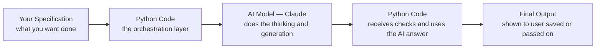

# Python's role — the orchestration layer connecting your specification to an AI system

---

## Introduction

You have spent the first part of this program thinking like an AI engineer — understanding how AI works, writing specifications, evaluating outputs, and making judgment calls about oversight. But so far, you have not written a single line of code. That changes now.

**Python** is a programming language — a way of writing instructions that a computer follows exactly, step by step. Think of it like this: you already know how to give instructions in English. Python is simply a more precise, more strict version of that — one where the computer actually executes every instruction you write, in order, without any guessing.

You will not use Python to build AI from scratch. You will use Python as the **orchestration layer** — the part of the system that decides when to call the AI, what to ask it, and what to do with the answer. Think of it like a restaurant. The **waiter** (Python) takes your order, passes it to the kitchen, collects the food, and brings it to your table. The **chef** (the AI) does the actual cooking. The waiter does not cook — but without the waiter, nothing reaches the customer.

---

## What Is Python and What Is Code?

**Python** is a programming language — a set of written instructions, following strict rules, that tells a computer exactly what steps to perform.

A computer does not think. It follows instructions. **Code** (also called a program or a script) is the text you write containing those instructions. Python reads your code one line at a time, from top to bottom, and executes each instruction in order.

**Why Python specifically?**

| Reason | What it means for you |
|---|---|
| **Readable syntax** | Python code looks close to plain English. `if score > 50:` reads almost like a sentence — making it the easiest widely-used language for beginners |
| **Huge AI ecosystem** | Anthropic, OpenAI, Google, and almost every AI company provide official Python tools to call their models — you will use this directly in the coming weeks |
| **Widely used in industry** | Python is one of the most in-demand languages for data science, AI engineering, and backend development globally |

---

## Python's Role — The Orchestration Layer

Here is the key mental model for everything you will build in this program:

Notice that Python appears **twice** — before the AI call and after it:

- **Before:** Python prepares the exact question to send to the AI, based on your specification
- **After:** Python receives the AI's response and decides what to do — check the format, extract the relevant part, handle errors, save the result

The AI does not run on its own. Something has to call it, pass the right information, and handle what comes back. That something is Python.

> **Important:** You do not need Python to use an AI chatbot casually — typing into Claude.ai in your browser needs no code. You need Python when you want to **build a system** that uses AI as one component alongside other logic — validation, error handling, multiple steps, storing results. That is the difference between being an AI user and an AI-native engineer.

**Specification vs Code vs AI Call — what each one is:**

| Activity | What you are doing | Example |
|---|---|---|
| Writing a specification | Describing in plain English what the system should do | "Given a list of exam marks, calculate the average and flag any mark below 35 as a fail" |
| Writing Python code | Turning part of the specification into precise, deterministic instructions | `average = sum(marks) / len(marks)` |
| Calling an AI model | Asking the AI to generate something that has no single fixed answer | "Write an encouraging one-line message for a student who scored 32 out of 100" |

---

## What You Will Learn in This Module

To build this orchestration layer, you first need to understand the basic building blocks of Python. In the upcoming lessons of this week, we will cover the core foundations:

- **The Python Environment:** How to write and run Python code interactively (REPL) using Google Colab.
- **Variables, Identifiers & Types:** How to store data (text, numbers, booleans) in memory, name them properly, and get input from the user.
- **Conditionals:** How to make decisions in your code using `if`, `elif`, and `else` to execute different logic based on specific conditions.
- **Loops:** How to repeat actions efficiently using `for` and `while` loops, iterate over sequences, and control loop execution.

By the end of this module, you will have a solid grasp of these core programming concepts, which form the foundation for integrating Python with AI models later in the program.
