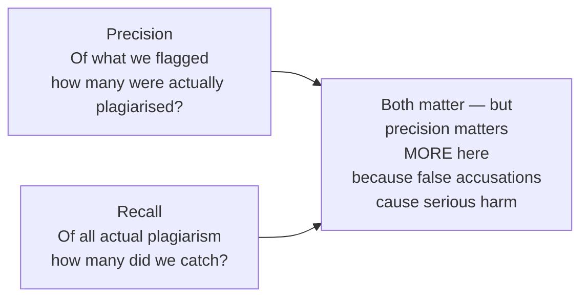

# Evaluation Metrics in Depth

---

## Learning Objectives

By the end of this topic, you should be able to:

- Explain the difference between precision and recall in plain language, without relying on formulas alone
- Identify which metric matters more for a given real-world scenario and justify why
- Calculate accuracy, precision, recall, and F1 score by hand from a confusion matrix
- Tell the difference between a model that is "accurate but useless" and one that is "genuinely reliable"
- Evaluate a classifier's performance and make a justified deployment recommendation

---

## Overview

A single number like "98% accuracy" can look impressive while hiding a model that is nearly useless. In real AI work, you need multiple metrics — precision, recall, and F1 — to get the full picture and make a justified judgment call.

We will use one scenario throughout this entire topic: a **college plagiarism detector** — an AI system that flags student assignments as "plagiarised" or "original." Every concept will be introduced and then immediately shown in this context, so you can see exactly what each metric means in practice.

---

## The Scenario — A College Plagiarism Detector

A college has built an AI system to scan student assignments and flag any it believes are plagiarised. The system is tested on 50 real assignments — some of which were confirmed plagiarised, some of which were genuine student work.

Before any numbers: think about what kind of mistake is more costly here.

- **A false alarm** = the system flags a genuine student as a plagiarist. That student faces disciplinary action for something they did not do. This is serious academic harm.
- **A missed case** = the system clears an assignment that was actually plagiarised. The student gets away with it.

Both are bad — but most academic institutions would say wrongly accusing an innocent student is the more serious mistake. This means we care more about **precision** than recall here. Keep this in mind as we work through the numbers.

---

## Precision — Are Our Flags Accurate?

**Precision** asks: *"Of every assignment the model flagged as plagiarised, how many were actually plagiarised?"*

Think of it like this. If the system flags 10 assignments and only 6 of them were actually plagiarised, precision is 60%. That means 4 innocent students were accused — a serious problem.

**High precision** = when the model flags something, it is almost always right. Very few innocent students are wrongly accused.

**Low precision** = the model is trigger-happy. It flags lots of assignments, but many of those are genuine student work. Lots of innocent students suffer.

**For the plagiarism detector:** We want high precision. The model should only flag an assignment when it is very confident — not flag everything and let the humans sort it out.

---

## Recall — Are We Catching Everything?

**Recall** asks: *"Of all the assignments that were actually plagiarised, how many did the model catch?"*

If there were 10 genuinely plagiarised assignments and the model only caught 7, recall is 70%. Three plagiarists got away.

**High recall** = the model catches almost every real case. Rarely misses a plagiarised assignment.

**Low recall** = the model misses a lot of real cases. Many plagiarised assignments slip through unchecked.

**For the plagiarism detector:** Recall matters, but it is the secondary concern. Missing a plagiarised assignment means one student gets away with it — serious, but less damaging than wrongly accusing an innocent student.



---

## Why You Cannot Maximise Both at the Same Time

Here is the fundamental tension: making the model more aggressive improves recall but hurts precision. Making it more cautious improves precision but hurts recall.

**Aggressive detector** — flags any assignment with even a hint of similarity to another source:
- Recall goes up — catches more real plagiarism
- Precision goes down — also flags lots of genuine work as plagiarised

**Cautious detector** — only flags assignments it is extremely confident about:
- Precision goes up — when it does flag, it is almost always right
- Recall goes down — misses plagiarism cases that are harder to detect

There is no setting that maximises both. For the plagiarism detector, we lean toward cautious — we would rather miss some cases than wrongly accuse innocent students.

---

## The Confusion Matrix — Four Types of Outcomes

After testing the plagiarism detector on 50 assignments, here are the results:

| | Predicted: Plagiarised | Predicted: Original |
|---|---|---|
| **Actual: Plagiarised** | TP = 8 | FN = 2 |
| **Actual: Original** | FP = 5 | TN = 35 |

**What each cell means — in plain English for this scenario:**

| Term | What it means | In this example |
|---|---|---|
| **TP = 8** | Correctly flagged — assignment was plagiarised and model caught it | 8 actual plagiarists correctly identified |
| **FN = 2** | Missed — assignment was plagiarised but model said "original" | 2 plagiarists got through undetected |
| **FP = 5** | False alarm — model said "plagiarised" but assignment was genuine | 5 innocent students wrongly accused |
| **TN = 35** | Correctly cleared — assignment was genuine and model said so | 35 genuine students correctly left alone |

**How the formulas connect to the matrix — visual guide:**

```
                   Predicted: Plagiarised   Predicted: Original
Actual: Plagiarised       TP = 8      ←─────────    FN = 2
                           ↑                          ↑
                     Precision uses             Recall uses
                     this column                this row
                    TP ÷ (TP + FP)            TP ÷ (TP + FN)
Actual: Original          FP = 5               TN = 35
```

---

## Computing All Four Metrics

**Step 1 — Sanity check** *(always do this first)*

Add all four cells — do they equal 50?

```
8 + 2 + 5 + 35 = 50 ✓
```

Row totals:
```
Actual plagiarised = TP + FN = 8 + 2 = 10
Actual original   = FP + TN = 5 + 35 = 40
```

Everything adds up. We can trust the matrix.

---

**Step 2 — Accuracy** *(what proportion of all predictions were correct?)*

```
Accuracy = (TP + TN) / Total
         = (8 + 35) / 50
         = 43 / 50
         = 86%
```

> 86% sounds good. But it tells us nothing about whether we are wrongly accusing innocent students. We need precision to answer that.

---

**Step 3 — Precision** *(of every assignment flagged as plagiarised, how many actually were?)*

```
Precision = TP / (TP + FP)
          = 8 / (8 + 5)
          = 8 / 13
          ≈ 61.5%
```

> More than 1 in 3 students flagged as plagiarists actually submitted genuine work. For every 13 flags the model raises, 5 are innocent students. This is a serious problem for our use case.

---

**Step 4 — Recall** *(of all actual plagiarism cases, how many did the model catch?)*

```
Recall = TP / (TP + FN)
       = 8 / (8 + 2)
       = 8 / 10
       = 80%
```

> The model caught 8 out of 10 real plagiarism cases. It missed 2 — those students got away with it. 80% is reasonable, but recall is our secondary concern here.

---

**Step 5 — F1 Score** *(the balanced single metric)*

Sometimes you need one number that balances both. That is the F1 score. It uses a harmonic mean — which punishes extreme imbalance — rather than a simple average.

**Why not just average them?** If precision = 100% and recall = 1%, the simple average says 50.5% — "not bad." But the model is nearly useless — it catches almost no real cases. F1 would give it 2%, which correctly reflects how broken it is.

```
F1 = 2 × (Precision × Recall) / (Precision + Recall)
   = 2 × (0.615 × 0.80) / (0.615 + 0.80)
   = 2 × 0.492 / 1.415
   ≈ 69.5%
```

> F1 of 69.5% is being pulled down by the low precision. The harmonic mean always pulls toward the weaker number — which is exactly right. A 61.5% precision problem cannot be hidden behind an 80% recall.

---

## Reading the Results Together

| Metric | Score | What it means for the plagiarism detector |
|---|---|---|
| Accuracy | 86% | Looks good — but hides the false accusation problem |
| Precision | 61.5% | 1 in 3 flagged students are innocent — the critical weakness |
| Recall | 80% | Catches 4 in 5 real cases — reasonable |
| F1 | 69.5% | Pulled down by low precision — reflects the real problem |

**The judgment call:**

> Precision at 61.5% is a red flag for this specific system. More than a third of the students it accuses are innocent. For a system where a false accusation can seriously damage a student's academic record, this model is not ready for autonomous deployment. It can be used as a first-pass screening tool — but a human reviewer must verify every flag before any disciplinary action is taken.

Notice how 86% accuracy alone would have hidden this completely. "86% accurate" sounds like a good system. "1 in 3 accused students is actually innocent" makes the problem obvious.

---

## Best Practices

- Always decide which metric matters most for your use case **before** looking at the numbers — not after. For the plagiarism detector, we decided "precision matters more" before calculating anything
- Always calculate precision and recall separately before looking at F1 — F1 alone can hide which type of error is dominant
- Always sanity-check the confusion matrix totals before calculating — arithmetic errors here corrupt everything that follows

## Common Beginner Mistakes

- **Mixing up the denominators** — Precision uses TP + FP (the flagged column). Recall uses TP + FN (the actual positives row). Use the visual guide until this is automatic
- **Reporting only accuracy** — 86% accuracy told us almost nothing useful here. Always check precision and recall
- **Simple-averaging precision and recall instead of F1** — the simple average hides the disaster when one metric is very low
- **Assuming both low precision and low recall just needs more data** — sometimes it signals a fundamental design problem

---

## Key Takeaways

- **Precision** = of what the model flagged, how much was correct. For the plagiarism detector: of flagged assignments, how many were actually plagiarised?
- **Recall** = of all real positives, how many did the model catch. For the plagiarism detector: of all actual plagiarism, how much did we find?
- Improving one usually costs the other — choose which mistake is more costly for your specific use case
- **F1** = harmonic mean of precision and recall. Punishes extreme imbalance. Use it when both errors carry similar cost
- Accuracy alone is dangerously misleading on imbalanced datasets — the plagiarism dataset has 40 originals and only 10 plagiarised. Always check precision and recall
- High-stakes domains always require a human-in-the-loop check — the numbers alone do not decide deployment

> **Interview tip:** When given a confusion matrix, do not just calculate the numbers — explain what each result means for that specific use case and make a deployment recommendation. The interpretation is what interviewers are testing. Most candidates calculate correctly but cannot explain.

---

## Reference Links

- 📎 [Google Machine Learning Crash Course — Precision and Recall](https://developers.google.com/machine-learning/crash-course/classification/precision-and-recall) — official interactive explanation
- 📎 [NIST AI Risk Management Framework — Measure Function](https://www.nist.gov/itl/ai-risk-management-framework) — why documented evaluation metrics matter for AI system oversight
- 📎 [Towards Data Science — Understanding the Confusion Matrix](https://towardsdatascience.com/understanding-confusion-matrix-a9ad42dcfd62) — visual breakdowns of all four metrics
