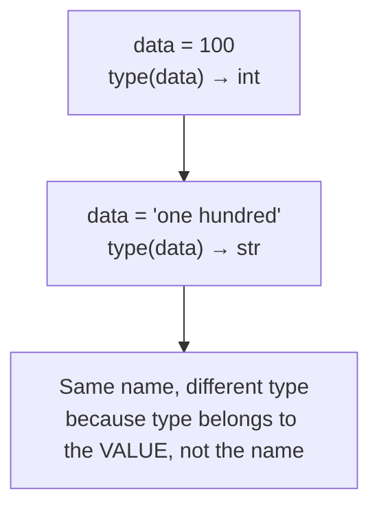
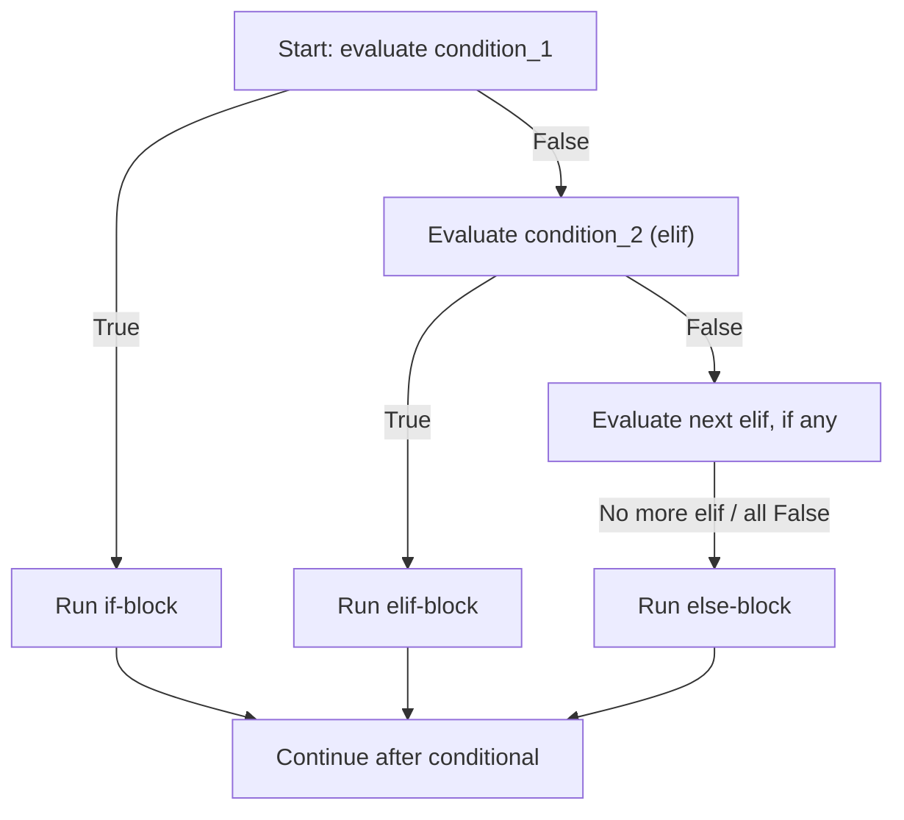
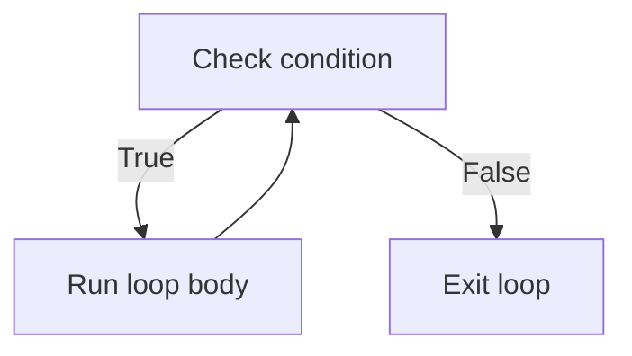
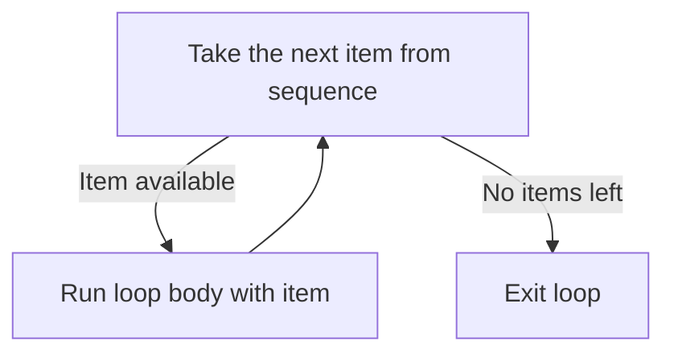

# Core Python Concepts

---

## Learning Objectives

By the end of this unit, you will be able to:

- **Create** a variable using the assignment operator (`=`) and change its value by reassigning it.
- **Apply** Python's naming rules and the `snake_case` convention to write legal, readable identifiers.
- **Identify** the four basic value types — `int`, `float`, `str`, and `bool` — from how a value is written.
- **Implement** the `type()` function to inspect the type of any value at any point in a program.
- **Differentiate** between statically typed languages and Python's dynamically typed approach.
- **Debug** the two most common beginner errors in this area — `NameError` from case mismatches and `SyntaxError` from illegal identifier names.
By the end of this unit, you will be able to:

- **Explain** how an `if` statement uses a boolean expression to decide whether a block of code runs.
- **Implement** multi-branch decisions using `if`/`elif`/`else`, ensuring exactly one branch executes.
- **Describe** how indentation defines the structure of a conditional block in Python.
- **Apply** compound boolean expressions (`and`, `or`, `not`, chained comparisons) inside conditions.
- **Differentiate** between a nested conditional and a flattened compound condition, and judge which reads better.
- **Create** compact value-choosing logic using the conditional (ternary) expression.
By the end of this unit, you will be able to:

- **Explain** how a `while` loop repeats a block based on a condition, and how a `for` loop repeats a block once for each item in a sequence.
- **Implement** `range()` to generate numeric sequences using `start`, `stop`, and `step`, and use it to drive a `for` loop a fixed number of times.
- **Apply** `enumerate()` to track a position while looping and `zip()` to walk two sequences together in step.
- **Differentiate** between `break` and `continue`, and predict exactly how each one changes a loop's execution.
- **Debug** the classic infinite-loop mistake and the off-by-one errors that come from misreading `range()`.
- **Create** nested loops to solve grid-shaped problems such as tables, seat charts, and reports.

---

## Overview

### Variables, Identifiers & Types

Working in the Python environment, you learned to type code into a Colab cell, run it, and use `print()` to see a result. That's a good start, but think about what a real application does — a banking app remembers your account balance, a food delivery app remembers your cart total, a UPI app remembers the amount you're about to pay. None of that is possible if every value disappears the moment it's printed.

This is exactly the gap a **variable** fills. A variable gives a value a name, so your program can refer to it again and again, and update it in one place instead of hunting down every copy scattered across the code. This single idea — "give it a name, use the name" — is the single most-used concept in all of software development; you will use it in literally every program you ever write, from your first Colab cell to a production banking system.

In this unit, you will learn how to create variables, the rules and conventions for naming them properly, the four basic types of values you'll use constantly (`int`, `float`, `str`, `bool`), how to check a value's type using the `type()` function, and why Python doesn't require you to declare a type in advance — a behaviour called dynamic typing. These are the true building blocks of every Python program you will write in this course and in your career.

### Conditionals

Every program you have written so far in this course runs top to bottom, one line after another, with no branching at all. Real software rarely behaves that way. A login screen must respond differently to a correct password than a wrong one. A UPI app must show "Payment Successful" or "Payment Failed" depending on what the bank returns. A food delivery app decides whether an order qualifies for free delivery based on the cart value. None of this is possible without a way to make a decision inside the code itself.

That decision-making ability comes from a **conditional** — a piece of code that asks a yes/no question and runs different statements depending on the answer. The question is always a **boolean expression**, one that evaluates to `True` or `False`, built using the comparison and logical operators you already learned in operators and expressions.

In this unit, you will learn the `if` statement, how to add `elif` and `else` for multi-branch decisions, how to combine conditions using `and`/`or`/`not`, how to nest one conditional inside another, and how to write a compact conditional (ternary) expression for simple two-value choices. Mastering this one skill — asking a question and branching on the answer — is the foundation that every later topic in this course, from loops to functions to real applications, is built on.

### Loops

Every program you've written so far in this course runs each line exactly once, top to bottom. Real software rarely works that way. A banking app checks every transaction in a statement. A food delivery app polls an order's status again and again until it's delivered. An e-commerce site prints every item in an invoice, however many there are. Writing the same `print()` statement fifty times is not a solution — it doesn't scale, and it breaks the moment the number of items changes. What you need is a way to tell Python: "repeat this block, either while some condition holds, or once for every item in a sequence."

That mechanism is called a **loop**, and it is one of the core control-flow structures, alongside conditionals, which you already learned. Python gives you exactly two loop keywords — `while`, which repeats *as long as* a condition stays `True`, and `for`, which repeats *once per item* in a sequence. Around these two keywords sit a small toolkit that makes looping practical in real code: `range()` to generate numbers to loop over, `enumerate()` to track position, `zip()` to walk two sequences together, and `break`/`continue` to redirect a loop's flow from inside its own body. Indian IT companies test loop fundamentals in nearly every entry-level coding round — this unit is the foundation for almost everything you will build from here on.

---

## Description

### Variables, Identifiers & Types

#### Definition

A **variable** is a name that refers to a value stored in the computer's memory. Think of it like a labelled box: the label is the name you choose, and the box holds whatever value you put inside. You create a variable using the **assignment operator**, the single equals sign `=`, with the name on the left and the value on the right:

**Example:**

```python
x = 5
```

Read this as "let `x` refer to the value `5`" — not "x equals 5" in the mathematical sense. In mathematics, `=` states a fact that is either true or false. In Python, `=` performs an **action**: it binds the name on the left to the value on the right.

#### Why This Concept Exists

Without variables, every program would be limited to `print()`-ing fixed text once and forgetting it — exactly the limitation you hit at the end of your first look at the Python environment. Real software constantly needs to:

- **Remember** a value across multiple steps (a customer's cart total while they keep shopping).
- **Reuse** a value in several places without retyping it (a tax rate applied to every item).
- **Update** a value as the program runs (a bank balance after each transaction, a score after each level).

A variable solves all three problems with one mechanism: give the value a name once, and let the rest of your program refer to that name instead of the raw value. This is why "variables and assignment" is universally the second thing every programming course teaches, right after "how do I run code at all."

#### Key Terminology

| Term | Simple Meaning |
|---|---|
| **Variable** | A name that refers to a value stored in memory. |
| **Assignment operator (`=`)** | The symbol used to bind a name to a value. |
| **Reassignment** | Giving an existing variable a new value, replacing the old one. |
| **Identifier** | The technical term for the name you give a variable, function, or other object. |
| **Reserved keyword** | A word Python has already claimed for its own grammar (e.g. `if`, `for`, `class`) — you cannot use it as a variable name. |
| **Case sensitivity** | Python treats uppercase and lowercase letters as different, so `total` and `Total` are two unrelated names. |
| **`snake_case`** | The Python naming convention: all lowercase words separated by underscores, e.g. `total_price`. |
| **Type** | A category that says what kind of value something is — a number, text, or a true/false value. |
| **`int`** | A whole number with no decimal point, e.g. `42`. |
| **`float`** | A number written with a decimal point, e.g. `42.0`. |
| **`str`** | Text data, written inside quotation marks, e.g. `"hello"`. |
| **`bool`** | A truth value: exactly `True` or `False`. |
| **`type()`** | A built-in function that tells you the type of any value. |
| **`input()`** | A built-in function that pauses the program, displays an optional prompt, and returns whatever the user types — always as a `str`. |
| **Dynamic typing** | Python's behaviour of determining a value's type automatically at assignment time, rather than requiring you to declare it in advance. |
| **`NameError`** | The error Python raises when you try to use a variable that was never assigned. |
| **`SyntaxError`** | The error Python raises when code breaks the language's grammar rules, such as an illegal variable name. |

#### Syntax

```python
name = value
```

| Part | What it is | Why it's there |
|---|---|---|
| `name` | The **identifier** — the label you are choosing for this value. | This is what you will type later to retrieve the value. |
| `=` | The **assignment operator**. | It tells Python "bind the name on my left to the value on my right." It is not a mathematical equals sign. |
| `value` | Any expression Python can evaluate — a number, a string, another variable, or a calculation. | Python works this out completely first, *then* binds the name to the result. |

Reassignment uses the exact same syntax, just written again later in the program:

**Example:**

```python
score = 100      # first assignment — score is created
score = 150      # reassignment — score's old value (100) is replaced
```

**Getting a value from the user: `input()`**

Every example so far has assigned a value you typed directly into the code. Real programs usually need to ask the *person running the program* for a value instead — a name, an age, an amount to pay. The built-in **`input()`** function does exactly this: it pauses the program, displays an optional prompt message, waits for the user to type something and press Enter, and then hands back whatever they typed.

**Example:**

```python
name = input("Enter your name: ")
print("Hello,", name)
```

*Line-by-line explanation:*
- `input("Enter your name: ")` displays the text `Enter your name: ` on the screen and then pauses — the program does nothing further until the user types a response and presses Enter.
- Whatever the user typed is returned by `input()` as a value, and `name = ...` immediately assigns that returned value to the variable `name`, exactly like any other assignment.
- `print("Hello,", name)` then displays a greeting using whatever the user entered.
- Sample run (user types `Ada` and presses Enter):
  ```
  Enter your name: Ada
  Hello, Ada
  ```

| Part | What it is | Why it's there |
|---|---|---|
| `input(...)` | The built-in function that reads one line of text typed by the user. | This is how a program collects information from a real person instead of having every value hard-coded. |
| `"Enter your name: "` | An optional **prompt** string, shown before the program waits. | Tells the user what kind of value is expected; without it, the program would still wait, but with no visible message. |
| Return value | **Always a `str`**, no matter what the user types — even `input("Enter your age: ")` with `20` typed in returns the *string* `"20"`, not the number `20`. | This is the single most important fact about `input()`: you must explicitly convert it (using `int()` or `float()`, covered later when we look at statements, conversion, and output) before using it as a number. |

See this for yourself — even though the user types a number below, `type()` proves what `input()` actually handed back:

**Example:**

```python
age = input("Enter your age: ")
print(type(age))
```

*Line-by-line explanation:*
- `age = input("Enter your age: ")` waits for the user to type a response. Suppose the user types `20` and presses Enter — it *looks* like a number was entered.
- `print(type(age))` asks Python to report the actual type of whatever `age` refers to.
- Sample run (user types `20` and presses Enter):
  ```
  Enter your age: 20
  <class 'str'>
  ```
  Even though `20` looks exactly like a number, `type()` confirms it is a `str` — `input()` never returns anything but text. If you tried `age + 5` right now, Python would raise a `TypeError`, because you cannot add a number to a string; you would first need to convert `age` with `int(age)`.

**Use case:** `input()` is what turns a fixed script into an interactive program — a login prompt asking for a username, a calculator asking for two numbers, a quiz asking for an answer, or a food delivery app asking for a delivery address all start with `input()` collecting something directly from the person using the program.

**Comparison Table: Statically Typed vs Dynamically Typed Languages**

| Aspect | Statically Typed (e.g., Java, C) | Dynamically Typed (e.g., Python) |
|---|---|---|
| Type declaration | You must declare the type up front, e.g. `int age = 30;` | You never declare a type — Python infers it from the value |
| When type is checked | Before the program runs (compile time) | While the program runs (run time) |
| Can a variable change type? | No — a variable keeps its declared type forever | Yes — the same name can refer to an `int` now and a `str` later |
| Beginner impact | More upfront typing, catches some mistakes earlier | Faster to write, but you must track types yourself using `type()` |

**Dynamic Typing Over Time**



#### Rules

**Identifier rules (enforced by Python — break one and your code will not run):**

- May contain letters, digits, and the underscore `_`.
- Must **not start with a digit** — `age2` is legal, `2age` is not.
- May not contain spaces or symbols such as `-`, `!`, or `$`.
- Must not be a **reserved keyword** (`if`, `for`, `class`, `True`, `False`, etc.).

**Assignment rules:**

- A variable must be assigned at least once before you can use it — using it earlier raises a `NameError`.
- The right-hand side is always fully evaluated *before* the name is bound or rebound.
- Python is **case sensitive**: `total`, `Total`, and `TOTAL` are three completely separate variables.

#### Best Practices

- Follow **PEP 8** (Python's official style guide) and use `snake_case` for variable names: `total_price`, not `TotalPrice` or `totalprice`.
- Choose names that describe the value's *purpose*, not its type: `customer_age` is better than `x` or `intvalue`.
- Keep one spelling and one case per variable throughout your program — never switch between `total` and `Total` for the same value.
- Use `type()` whenever you're unsure what a value's type is, rather than guessing from how it looks.
- Assign a variable close to where it is first used, so a reader doesn't have to search far to understand it.

#### Common Mistakes

- **Using a variable before assigning it** — leads to `NameError: name '...' is not defined`. A variable only exists after its first assignment.
- **Starting an identifier with a digit** (`2age = 30`) — Python cannot parse the name at all and raises a `SyntaxError` before running anything.
- **Colliding with a reserved keyword** (`class = "10A"`) — causes a confusing `SyntaxError`; rename the identifier (`class_name` instead of `class`).
- **Assuming case doesn't matter** — writing `total` in one line and `Total` in another creates two separate, unrelated variables, not a typo Python will forgive.
- **Confusing `"5"` (a string) with `5` (an integer)** — they look similar but are different types; `type()` will immediately clear this up.

#### Code Examples

**Scenario:** we'll build one running example — tracking a Swiggy-style food delivery order — in four short stages. Each stage keeps every line from the stage before it and adds a few new ones, so by the end you can see the whole idea of variables, reassignment, types, and `input()` working together in a single program.

**Stage 1 — create and print a single variable (the item's price):**

```python
item_price = 149
print(item_price)
```

*Line-by-line explanation:*
- `item_price = 149` — binds the name `item_price` to the value `149`.
- `print(item_price)` — Python looks up what `item_price` refers to and displays it.
- Output: `149`.

**Stage 2 — the customer changes their order, so the price is reassigned:**

```python
item_price = 149
print(item_price)

item_price = 249
print(item_price)
```

*Line-by-line explanation:*
- The first two lines are unchanged from Stage 1 and still print `149`.
- `item_price = 249` is a **reassignment** — the old value `149` is discarded, and `item_price` now refers to `249`.
- The second `print(item_price)` shows the new value.
- Output:
  ```
  149
  249
  ```

**Stage 3 — store the rest of the order using one variable of each basic type, and inspect them with `type()`:**

```python
item_price = 149
print(item_price)

item_price = 249
print(item_price)

customer_name = "Ananya Roy"
delivery_fee = 29.50
order_id = "SWG10234"
is_paid = False

print(type(customer_name))
print(type(delivery_fee))
print(type(order_id))
print(type(is_paid))
```

*Line-by-line explanation:*
- `customer_name = "Ananya Roy"` — wrapped in quotes, so Python stores it as a `str`.
- `delivery_fee = 29.50` — written with a decimal point, so Python stores it as a `float`.
- `order_id = "SWG10234"` — quoted, so it's a `str`, even though it contains digits; it is text to display, not a number to calculate with.
- `is_paid = False` — one of exactly two allowed values, so Python stores it as a `bool`, starting as "not yet paid."
- The four `print(type(...))` lines report each stored type, with no need to declare any of them in advance — this is dynamic typing in action. Output:
  ```
  149
  249
  <class 'str'>
  <class 'float'>
  <class 'str'>
  <class 'bool'>
  ```

**Stage 4 — ask the customer for their delivery address with `input()`, then confirm payment:**

```python
item_price = 149
print(item_price)

item_price = 249
print(item_price)

customer_name = "Ananya Roy"
delivery_fee = 29.50
order_id = "SWG10234"
is_paid = False

print(type(customer_name))
print(type(delivery_fee))
print(type(order_id))
print(type(is_paid))

address = input("Enter your delivery address: ")
print("Deliver to:", address)
print(type(address))

is_paid = True
print("Payment status:", is_paid)
```

*Line-by-line explanation:*
- `address = input("Enter your delivery address: ")` displays the prompt and pauses until the user types a response and presses Enter; whatever they type is assigned to `address`.
- `print("Deliver to:", address)` displays a label and the address together.
- `print(type(address))` proves that `input()` always hands back a `str`, no matter what the user types.
- `is_paid = True` is another reassignment — the same name that held `False` now refers to `True`, simulating the moment payment succeeds.
- Sample run (user types `12 MG Road, Bengaluru` and presses Enter):
  ```
  149
  249
  <class 'str'>
  <class 'float'>
  <class 'str'>
  <class 'bool'>
  Enter your delivery address: 12 MG Road, Bengaluru
  Deliver to: 12 MG Road, Bengaluru
  <class 'str'>
  Payment status: True
  ```

#### Try It Yourself

Sticking with the same food delivery scenario, extend the program yourself. Attempt each part before checking the solution.

**(a)** Create a variable `restaurant_name` holding the text `"Spice Route"`, print it, and then print its type.

**Solution:**
```python
restaurant_name = "Spice Route"
print(restaurant_name)
print(type(restaurant_name))
```
Expected output:
```
Spice Route
<class 'str'>
```

**(b)** Add two more variables: `quantity` set to `3` (the number of items ordered) and `packing_charge` set to `15.0`. Print the type of `restaurant_name`, `quantity`, and `packing_charge`, one per line.

**Solution:**
```python
restaurant_name = "Spice Route"
quantity = 3
packing_charge = 15.0

print(type(restaurant_name))
print(type(quantity))
print(type(packing_charge))
```
Expected output:
```
<class 'str'>
<class 'int'>
<class 'float'>
```

**(c)** Using `input()`, ask the customer to type their name into a variable called `customer_name`. Print a message that says `"Order for:"` followed by `customer_name`. Then create a variable `order_confirmed` starting as `False`, reassign it to `True` once the order is placed, and print `"Order confirmed:"` followed by `order_confirmed`.

**Solution:**
```python
customer_name = input("Enter your name: ")
print("Order for:", customer_name)

order_confirmed = False
order_confirmed = True
print("Order confirmed:", order_confirmed)
```
Expected output (user types `Rahul` and presses Enter):
```
Enter your name: Rahul
Order for: Rahul
Order confirmed: True
```

### Conditionals

#### Definition

A **conditional** is a control structure that runs one block of code or another depending on whether a **boolean expression** — a condition — evaluates to `True` or `False`. In Python, the primary conditional tool is the `if` statement, optionally extended with `elif` (else if) and `else`:

**Example:**

```python
temperature = 30

if temperature > 25:
    print("It is warm.")
```

Read this as: "if the condition `temperature > 25` is `True`, run the indented block below it." Because `30 > 25` evaluates to `True`, the block runs and `It is warm.` is printed. If `temperature` had been `20`, the condition would be `False`, and Python would skip the block entirely.

#### Why This Concept Exists

Without conditionals, a program could only ever do exactly one fixed sequence of steps, regardless of the data it was given. Real software constantly needs to:

- **React** differently to different inputs (a correct password versus a wrong one).
- **Classify** a value into one of several categories (a task marked "urgent," "soon," or "whenever").
- **Guard** against unsafe or invalid situations before proceeding (checking a bank balance before allowing a withdrawal).

A conditional solves all three by letting the program's path change based on a boolean test, evaluated fresh every time the program runs. This is why `if`/`elif`/`else` is one of the very first control structures taught in every programming language — nearly nothing beyond simple arithmetic can be built without it.

#### Key Terminology

| Term | Simple Meaning |
|---|---|
| **Conditional** | A control structure that runs different code depending on whether a condition is `True` or `False`. |
| **Condition** | A boolean expression — one that evaluates to `True` or `False` — attached to an `if` or `elif`. |
| **`if` statement** | The basic conditional: runs its indented block only when its condition is `True`. |
| **`elif`** | Short for "else if"; adds another condition to check, only if all previous conditions were `False`. |
| **`else`** | The catch-all branch with no condition of its own; runs only when every earlier `if`/`elif` was `False`. |
| **Branch** | One possible path of execution inside a conditional — one `if`, `elif`, or `else` block. |
| **Block** | A group of statements indented at the same level, treated by Python as belonging together. |
| **Indentation** | The whitespace at the start of a line that Python uses, instead of braces, to define blocks. |
| **`IndentationError`** | The error Python raises when indentation is inconsistent or missing where a block is expected. |
| **Compound condition** | A condition built by combining two or more boolean expressions with `and`/`or`, or negating one with `not`. |
| **Chained comparison** | Python's shorthand for a range check, e.g. `0 <= score <= 100`, equivalent to `score >= 0 and score <= 100`. |
| **Nesting** | Placing one conditional entirely inside the block of another conditional. |
| **Conditional (ternary) expression** | A one-line expression of the form `value_if_true if condition else value_if_false` that *produces a value*, rather than just directing which statements run. |

#### Syntax

`if`/`elif`/`else` syntax:

```python
if condition_1:
    statement(s)          # runs only if condition_1 is True
elif condition_2:
    statement(s)          # runs only if condition_1 is False and condition_2 is True
else:
    statement(s)          # runs only if every condition above was False
```

| Part | What it is | Why it's there |
|---|---|---|
| `if` | Keyword that starts the first, mandatory branch. | Every conditional must begin with exactly one `if`. |
| `condition_1` | Any boolean expression Python can evaluate to `True` or `False`. | Decides whether the `if` block runs. |
| `:` | A colon after every condition. | Tells Python "the indented block that follows belongs to this branch." |
| Indented block | One or more statements, indented by the same amount (4 spaces is the standard). | Indentation, not braces, is how Python groups statements into a block. |
| `elif` | Optional keyword, short for "else if." | Adds another condition to check, only reached if all prior conditions were `False`. You may write zero, one, or many `elif` branches. |
| `else` | Optional, final keyword with no condition. | Catches every case not matched by any `if` or `elif` above it. |

**Decision Flow Through `if`/`elif`/`else`**



**Conditional (ternary) expression syntax:**

```
value_if_true if condition else value_if_false
```

| Part | What it is | Why it's there |
|---|---|---|
| `value_if_true` | The value produced when `condition` is `True`. | This is what the whole expression evaluates to on a `True` result. |
| `if condition else` | The test, written between the two possible values. | Reads almost like English: "this value if the condition holds, else that value." |
| `value_if_false` | The value produced when `condition` is `False`. | This is what the whole expression evaluates to on a `False` result. |

**Example:**

```python
age = 20
status = "adult" if age >= 18 else "minor"
print(status)
```

*Line-by-line explanation:*
- `age = 20` stores a whole number to test.
- `status = "adult" if age >= 18 else "minor"` is the ternary expression itself: Python first evaluates the condition `age >= 18`, which is `20 >= 18` → `True`. Because the condition is `True`, the whole expression evaluates to `value_if_true`, the string `"adult"` — `value_if_false` (`"minor"`) is never even looked at. The result is then stored in `status`, exactly like any ordinary assignment.
- `print(status)` displays whatever `status` ended up holding.
- Output:
  ```
  adult
  ```
  If `age` had been `15` instead, `age >= 18` would be `False`, so the expression would evaluate to `"minor"` instead, and that is what `status` would hold and `print()` would display.

#### Rules

- A conditional must start with exactly one `if`; `elif` and `else` are both optional, and there can be any number of `elif` branches, but at most one `else`, and it must come last.
- Every condition is evaluated **in order, top to bottom**; Python runs the block for the **first** condition that is `True` and then skips every remaining `elif`/`else`, even if a later condition would also have been `True`.
- If no condition is `True` and there is no `else`, Python simply runs nothing and moves on — this is silent, so missing an `else` can hide bugs.
- Every line inside a block must be indented by the same amount; Python's standard is 4 spaces per indentation level. Mixing tabs and spaces, or indenting inconsistently, raises an `IndentationError`.
- Any boolean expression can be a condition, including a variable that already holds `True`/`False`, a comparison (`==`, `!=`, `<`, `>=`, ...), or a compound expression built with `and`, `or`, `not`.
- A conditional (ternary) expression always evaluates to a value — it can be assigned, printed, or passed to another function — unlike an `if`/`else` statement, which only directs control flow and produces no value of its own.

#### Best Practices

- Put the most specific or most likely condition first in an `elif` chain — since only the first match runs, ordering affects the outcome.
- Include a final `else` whenever an unexpected value should still be handled, rather than silently doing nothing.
- Prefer a flattened `and` condition over nested `if` statements when both conditions are simply required together — `if logged_in and is_admin:` is easier to read than two nested `if` blocks.
- Use parentheses to group compound conditions when mixing `and` and `or`, e.g. `if (age >= 18 and has_id) or is_guest:`, so the intended logic is unambiguous at a glance.
- Use a chained comparison like `0 <= marks <= 100` for range checks instead of `marks >= 0 and marks <= 100` — it is shorter and reads exactly like the mathematical range it represents.
- Reserve the ternary expression for simple, single-line, two-value choices; if you find yourself chaining several ternaries together, switch to a full `if`/`elif`/`else` chain for readability.

#### Common Mistakes

- **Inconsistent indentation** — mixing 2 spaces and 4 spaces, or tabs and spaces, in the same block raises an `IndentationError`. Every line in a block must line up exactly.
- **Using `=` instead of `==` in a condition** — `if age = 18:` is a `SyntaxError`; assignment and comparison are different operators, and a condition always needs the comparison operator `==`.
- **Wrong branch order in an `elif` chain** — placing a broader condition before a narrower one can make the narrower one unreachable, e.g. checking `score >= 50` before `score >= 90` means the `90` case never gets its own message.
- **Forgetting `else`** — leaving out `else` when an unexpected value is possible means the program silently does nothing, which can hide a real problem instead of reporting it.
- **Over-nesting** — stacking three or four levels of nested `if` statements when a single compound condition with `and`/`or` would say the same thing far more clearly.
- **Overusing the ternary expression** — chaining several ternary expressions together to cover more than two outcomes produces a line that is technically valid but very hard to read; a full `if`/`elif`/`else` chain is the better choice there.

#### Code Examples

The examples below all build **one single scenario** — a food delivery app called **TastyBite** deciding how to handle an order. Each step adds exactly one new conditional idea on top of the last, so by the end you will have seen a plain `if`/`else`, an `elif` chain, a compound condition, nesting, and a ternary expression all working together on the same problem.

**Step 1 — a single `if`/`else`:** is the restaurant even open?

```python
restaurant_open = True

if restaurant_open:
    print("Welcome to TastyBite!")
else:
    print("Restaurant is currently closed.")

print("Thanks for checking.")
```

*Line-by-line explanation:*
- `restaurant_open = True` creates a `bool` variable representing one real fact about the restaurant right now.
- `if restaurant_open:` evaluates that variable directly — a variable that already holds `True`/`False` is itself a valid boolean expression.
- Because `restaurant_open` is `True`, the `if` block runs and the `else` block is skipped.
- `print("Thanks for checking.")` is not indented, so it is outside the conditional entirely and always runs, regardless of which branch fired.
- Output:
  ```
  Welcome to TastyBite!
  Thanks for checking.
  ```

**Step 2 — an `elif` chain:** classify the cart value into a delivery-fee tier.

```python
cart_value = 350.0

if cart_value >= 500:
    delivery_fee = 0.0
elif cart_value >= 200:
    delivery_fee = 20.0
else:
    delivery_fee = 40.0

print("Delivery fee: Rs.", delivery_fee)
```

*Line-by-line explanation:*
- `cart_value = 350.0` holds a `float`, the total value of items in the cart.
- Conditions are checked **top to bottom**: `cart_value >= 500` is `350.0 >= 500` → `False`, so Python moves on.
- `elif cart_value >= 200` is `350.0 >= 200` → `True`, so `delivery_fee` is set to `20.0` and every branch after this one is skipped.
- Output:
  ```
  Delivery fee: Rs. 20.0
  ```

**Step 3 — a compound condition:** a premium member should also get free delivery, even with a smaller cart.

```python
cart_value = 350.0
is_premium_member = True

if cart_value >= 500 or is_premium_member:
    delivery_fee = 0.0
else:
    delivery_fee = 40.0

print("Delivery fee: Rs.", delivery_fee)
```

*Line-by-line explanation:*
- `is_premium_member = True` adds a second fact the decision now depends on.
- The compound condition `cart_value >= 500 or is_premium_member` is `True` if **either** part is `True`. Here `350.0 >= 500` is `False`, but `is_premium_member` is `True`, so the whole `or` expression is `True` — only one side needs to hold.
- `delivery_fee` is set to `0.0`, and the plain `else` (`40.0`) is skipped.
- Output:
  ```
  Delivery fee: Rs. 0.0
  ```

**Step 4 — nesting:** the fee only matters if the restaurant is open in the first place, so the Step 3 logic now lives inside the Step 1 check.

```python
restaurant_open = True
cart_value = 350.0
is_premium_member = True

if restaurant_open:
    if cart_value >= 500 or is_premium_member:
        delivery_fee = 0.0
    else:
        delivery_fee = 40.0
    print("Delivery fee: Rs.", delivery_fee)
else:
    print("Restaurant is currently closed.")
```

*Line-by-line explanation:*
- The outer `if restaurant_open:` is checked first — there is no point computing a delivery fee for a closed restaurant.
- Because `restaurant_open` is `True`, Python enters the outer block and only then evaluates the inner `if cart_value >= 500 or is_premium_member:` from Step 3.
- The inner condition is `True` (because `is_premium_member` is `True`), so `delivery_fee` becomes `0.0` and the inner `print()` reports it.
- The outer `else` (`"Restaurant is currently closed."`) is never reached, because the outer condition was already `True`.
- Output:
  ```
  Delivery fee: Rs. 0.0
  ```
- Note that "what is the fee?" is only meaningful once we already know the restaurant is open — that dependency is exactly why nesting makes sense here, rather than flattening everything into one compound condition.

**Step 5 — a ternary expression:** turn the numeric fee into a short label for the screen.

```python
restaurant_open = True
cart_value = 350.0
is_premium_member = True

if restaurant_open:
    if cart_value >= 500 or is_premium_member:
        delivery_fee = 0.0
    else:
        delivery_fee = 40.0
    print("Delivery fee: Rs.", delivery_fee)

    order_label = "Free Delivery" if delivery_fee == 0.0 else "Delivery Charges Apply"
    print(order_label)
else:
    print("Restaurant is currently closed.")
```

*Line-by-line explanation:*
- The first five lines inside `if restaurant_open:` are exactly the nested logic from Step 4, so `delivery_fee` ends up `0.0` for the same reason as before.
- `order_label = "Free Delivery" if delivery_fee == 0.0 else "Delivery Charges Apply"` is a conditional (ternary) expression: Python evaluates `delivery_fee == 0.0`, finds it `True`, and the whole expression produces the value `"Free Delivery"` — `"Delivery Charges Apply"` is never even looked at. That value is stored in `order_label`, exactly like any ordinary assignment.
- This ternary line is placed inside the same `if restaurant_open:` block, because `delivery_fee` only exists once the restaurant has been confirmed open.
- Output:
  ```
  Delivery fee: Rs. 0.0
  Free Delivery
  ```
  If `cart_value` had been `120.0` and `is_premium_member` had been `False`, `delivery_fee` would be `40.0` instead, and `order_label` would evaluate to `"Delivery Charges Apply"`.

#### Try It Yourself

**Exercise — TastyBite Order Checker:** using the same TastyBite scenario, write the following in order. Try each part yourself before checking the solution.

**Part A (easiest):** Write a single `if`/`else` using `restaurant_open = False`. Print `"Order Now!"` if the restaurant is open, otherwise print `"Come back later."`.

**Solution:**

```python
restaurant_open = False

if restaurant_open:
    print("Order Now!")
else:
    print("Come back later.")
```

Expected output:
```
Come back later.
```

**Part B (medium):** Given `cart_value = 180.0` and `is_premium_member = False`, write an `if`/`elif`/`else` chain that sets `delivery_fee` to `0.0` if `cart_value >= 500` **or** `is_premium_member` is `True`, otherwise `20.0` if `cart_value >= 100`, otherwise `40.0`. Print the fee.

**Solution:**

```python
cart_value = 180.0
is_premium_member = False

if cart_value >= 500 or is_premium_member:
    delivery_fee = 0.0
elif cart_value >= 100:
    delivery_fee = 20.0
else:
    delivery_fee = 40.0

print("Delivery fee: Rs.", delivery_fee)
```

Expected output:
```
Delivery fee: Rs. 20.0
```

**Part C (hardest):** Combine everything: given `restaurant_open = True`, `cart_value = 620.0`, and `is_premium_member = False`, nest the Part B fee logic inside a check for `restaurant_open`, then add a ternary expression that stores `"Free Delivery"` in `order_label` if `delivery_fee == 0.0`, otherwise `"Delivery Charges Apply"`. Print the fee and the label.

**Solution:**

```python
restaurant_open = True
cart_value = 620.0
is_premium_member = False

if restaurant_open:
    if cart_value >= 500 or is_premium_member:
        delivery_fee = 0.0
    elif cart_value >= 100:
        delivery_fee = 20.0
    else:
        delivery_fee = 40.0
    print("Delivery fee: Rs.", delivery_fee)

    order_label = "Free Delivery" if delivery_fee == 0.0 else "Delivery Charges Apply"
    print(order_label)
else:
    print("Restaurant is currently closed.")
```

Expected output:
```
Delivery fee: Rs. 0.0
Free Delivery
```

### Loops

#### Definition

A **loop** is a control structure that repeats a block of code — the **loop body** — multiple times, either until a condition becomes `False` or until a sequence of items is exhausted. Each single repetition of the loop body is called an **iteration**. Python provides two loop statements: the `while` loop, which is condition-driven, and the `for` loop, which is sequence-driven.

```python
for letter in "hi":
    print(letter)
```

Read this as "for each `letter` in the text `"hi"`, run the block below." It runs the block twice — once with `letter` set to `"h"`, once with `letter` set to `"i"` — printing `h` and then `i`.

#### Why This Concept Exists

Without loops, repeating an action a hundred times would mean writing that action out a hundred times by hand — and the moment the count changes from a hundred to a thousand, the whole program has to be rewritten. Real software constantly needs to:

- **Repeat** an action a known number of times (print every row of a report, charge every item in a cart).
- **Repeat** an action until something changes (keep asking for a valid PIN until it's entered correctly).
- **Walk through** every item in a collection of data, one at a time, without knowing in advance how many items there are.

A loop solves all three with one mechanism: write the repeating action once, and let Python run it as many times as needed. This is why loops, right after conditionals, are the next concept every programming course teaches — nearly all real logic is "do this for every X" or "keep doing this until Y."

#### Key Terminology

| Term | Simple Meaning |
|---|---|
| **Loop** | A control structure that repeats a block of code multiple times. |
| **Loop body** | The indented block of statements that gets repeated. |
| **Iteration** | One single run through the loop body. |
| **`while` loop** | A loop that repeats as long as a given condition stays `True`. |
| **`for` loop** | A loop that repeats once for each item in a sequence. |
| **Loop variable** | The name that takes on each item's value in turn during a `for` loop. |
| **Iterable / sequence** | Something a `for` loop can walk through one item at a time — a string, a `range()`, or the result of `enumerate()`/`zip()`. |
| **`range()`** | A built-in function that produces a sequence of integers, controlled by `start`, `stop`, and `step`. |
| **`enumerate()`** | A built-in function that pairs each item in a sequence with an index, starting at `0` by default. |
| **`zip()`** | A built-in function that walks two (or more) sequences together, producing one item from each per pass. |
| **`break`** | A keyword that immediately ends the loop entirely, skipping any remaining iterations. |
| **`continue`** | A keyword that skips the rest of the current iteration and moves straight to the next one. |
| **Infinite loop** | A loop whose condition never becomes `False`, so it never stops on its own. |
| **Nested loop** | A loop placed inside the body of another loop. |
| **Off-by-one error** | A bug where a loop runs one time too many or one time too few, often caused by misreading `range()`'s exclusive stop value. |

#### Syntax

**`while` loop:**

```python
while condition:
    # loop body
```

| Part | What it is | Why it's there |
|---|---|---|
| `while` | The keyword that starts a condition-driven loop. | Tells Python to keep re-checking the condition. |
| `condition` | Any expression that evaluates to `True` or `False`. | Re-checked before every single iteration, including the first. |
| Indented block | The loop body. | Runs once per iteration, as long as `condition` is `True`. |

**`while` Loop**



Read this as: Python checks the condition first — if it's `True`, the body runs once, then control goes straight back to re-checking the condition. This repeats for as long as the condition stays `True`. The moment the condition is `False`, the loop exits without running the body again.

**`for` loop:**

```python
for item in sequence:
    # loop body
```

| Part | What it is | Why it's there |
|---|---|---|
| `for` ... `in` | Keywords that start a sequence-driven loop. | Tells Python to walk through `sequence` one item at a time. |
| `item` | The **loop variable** — your chosen name. | Holds the current item's value during each iteration. |
| `sequence` | Anything Python can iterate over — a string, `range(...)`, `enumerate(...)`, or `zip(...)`. | Defines what values `item` will take, and how many iterations run. |

**`for` Loop**



Read this as: Python pulls one item at a time from `sequence` and runs the body once with that item. This repeats automatically for every item — there is no condition to check yourself. The moment the sequence runs out of items, the loop exits on its own.

**Comparison Table: `for` Loop vs `while` Loop**

| Aspect | `for` Loop | `while` Loop |
|---|---|---|
| Driven by | A sequence (string, `range()`, etc.) | A condition (`True`/`False`) |
| Iteration count | Known in advance — equals the length of the sequence | Not known in advance — depends on when the condition turns `False` |
| Risk of infinite loop | None — it always ends when the sequence ends | Real risk if the condition never becomes `False` |
| Typical use case | "Do this for every item / N times" | "Keep doing this until some event happens" |
| Needs a manual counter? | No — the loop variable is managed automatically | Often yes, unless the condition depends on something external (like user input) |

**`range()`, `enumerate()`, `zip()`:**

| Call | Meaning | Example | Produces |
|---|---|---|---|
| `range(stop)` | Integers from `0` up to (not including) `stop`. | `range(5)` | `0, 1, 2, 3, 4` |
| `range(start, stop)` | Integers from `start` up to (not including) `stop`. | `range(2, 6)` | `2, 3, 4, 5` |
| `range(start, stop, step)` | Integers from `start` to `stop`, counting by `step`. | `range(0, 10, 2)` | `0, 2, 4, 6, 8` |
| `enumerate(sequence)` | Pairs each item with an index, starting at `0`. | `enumerate("hi")` | `(0, 'h'), (1, 'i')` |
| `enumerate(sequence, start)` | Same, but the index begins at `start`. | `enumerate("hi", 1)` | `(1, 'h'), (2, 'i')` |
| `zip(seq1, seq2)` | Pairs items from two sequences, position by position. | `zip("ab", "12")` | `('a','1'), ('b','2')` |

**`break` and `continue`:**

| Keyword | Effect | Where it belongs |
|---|---|---|
| `break` | Ends the loop immediately — no further iterations run. | Inside a loop body, usually behind an `if`. |
| `continue` | Skips the rest of the current iteration and jumps to the next one. | Inside a loop body, usually behind an `if`. |

#### Rules

- A `while` loop's condition is checked **before** every iteration, including the very first — if it's `False` to start with, the body never runs even once.
- A `for` loop's iteration count is decided entirely by the sequence it walks — you never write a stop condition yourself.
- `range()`'s `stop` value is always **exclusive** — `range(5)` never includes `5`.
- `zip()` stops the moment the **shorter** of its sequences runs out — no error, no warning, the extra items in the longer sequence are simply ignored.
- `break` and `continue` are only valid **inside** a loop body; using them outside a loop raises a `SyntaxError`.
- In a nested loop, `break` and `continue` only affect the **innermost** loop they are written in — they never reach out to an outer loop.

#### Best Practices

- Use a `for` loop whenever you already know what you're iterating over (a fixed range, a string, a sequence). Use a `while` loop only when you're repeating until some condition changes and you can't know the count in advance.
- Always double-check that a `while` loop has something in its body that moves its condition toward `False` — read that line back to yourself before running the code.
- Prefer `range()` over manually managing a counter variable with a `while` loop when you just need to repeat something a fixed number of times.
- Name loop variables for what they represent — `for student in ...` reads far better than `for x in ...`.
- Keep nested loops to two levels wherever possible; if you need a third level, consider whether the logic can be simplified first.
- Use `break` and `continue` sparingly and always pair them with a clear `if` condition — a loop with `break`/`continue` scattered everywhere becomes hard to trace.

#### Common Mistakes

- **Writing an infinite loop** — forgetting to update the variable a `while` condition depends on, so the condition is always `True` and the loop never ends.
- **Off-by-one errors with `range()`** — expecting `range(5)` to include `5`, or expecting `range(1, 5)` to include five numbers instead of four.
- **Assuming `break` exits every enclosing loop** — in a nested loop, `break` only exits the loop it is directly written inside; the outer loop keeps running unless it is told to stop separately.
- **Using `continue` and expecting it to end the loop** — `continue` only skips to the next iteration; it does not stop the loop the way `break` does.
- **Forgetting that `zip()` silently truncates** — pairing sequences of different lengths and being surprised that some items from the longer one never appear.
- **Modifying the loop variable inside a `for` loop** — reassigning the loop variable inside the body has no effect on which item comes next; the `for` loop still advances on its own.

#### Code Examples

One scenario runs through this entire section: a railway booking clerk is searching for the first available seat across three coaches (numbered `1` to `3`), each with five seats (numbered `1` to `5`). Each part below tackles a piece of that same scenario with a different loop tool, building up to the full search.

**Part 1** — checking coaches one by one with a `while` loop:

```python
coach = 1

while coach <= 3:
    print("Checking Coach", coach)
    coach = coach + 1
```

*Line-by-line explanation:*
- `coach = 1` creates the variable that the loop's condition depends on — the clerk starts at coach `1`.
- `while coach <= 3:` checks the condition before every iteration; as long as it's `True`, the body runs.
- `print("Checking Coach", coach)` announces which coach is currently being checked.
- `coach = coach + 1` is the crucial line — it moves `coach` closer to making the condition `False`. Without it, this loop would never stop.
- Output:
  ```
  Checking Coach 1
  Checking Coach 2
  Checking Coach 3
  ```
  Once `coach` becomes `4`, `4 <= 3` is `False`, and the loop ends.

**Part 2** — the same check, written as a `for` loop with `range()`:

```python
for coach in range(1, 4):
    print("Checking Coach", coach)
```

*Line-by-line explanation:*
- `range(1, 4)` produces the integers `1, 2, 3` — starting at `1`, stopping before `4`.
- `for coach in range(1, 4):` binds `coach` to each of those integers, one per iteration, three iterations in total.
- `print("Checking Coach", coach)` runs once per iteration with the current value of `coach`.
- Output:
  ```
  Checking Coach 1
  Checking Coach 2
  Checking Coach 3
  ```
  This is exactly the same output as Part 1, but with no counter to manage by hand — `range()` and the `for` loop take care of that entirely.

**Part 3** — checking coach names and seat counts together with `enumerate()` and `zip()`:

```python
coach_names = ("S1", "S2", "S3")
seats_available = (0, 5, 3)

for position, name in enumerate(coach_names, 1):
    print("Position", position, "-> Coach", name)

for name, seats in zip(coach_names, seats_available):
    print("Coach", name, "has", seats, "seat(s) available")
```

*Line-by-line explanation:*
- `coach_names` and `seats_available` are two short, fixed sequences of values written directly in parentheses — for now, just think of them as ready-made lists of values to loop over (you'll learn their proper name, tuples, in a later module).
- `enumerate(coach_names, 1)` pairs each coach name with a position counter that starts at `1` instead of the default `0`.
- The first loop prints each coach's position in the train alongside its name.
- `zip(coach_names, seats_available)` walks both sequences together, pairing `"S1"` with `0`, `"S2"` with `5`, and `"S3"` with `3` — one pair per iteration.
- The second loop prints each coach name next to how many seats it currently has free.
- Output:
  ```
  Position 1 -> Coach S1
  Position 2 -> Coach S2
  Position 3 -> Coach S3
  Coach S1 has 0 seat(s) available
  Coach S2 has 5 seat(s) available
  Coach S3 has 3 seat(s) available
  ```

**Part 4** — putting it together: searching for one free seat with nested loops, `continue`, and `break`:

```python
seat_found = False

for coach, seats in zip(range(1, 4), seats_available):
    if seats == 0:
        print("Coach", coach, "is full. Skipping to next coach.")
        continue
    for seat in range(1, 6):
        if coach == 2 and seat == 3:
            print(f"Seat {seat} in Coach {coach} is available. Booking now.")
            seat_found = True
            break
    if seat_found:
        break

if not seat_found:
    print("No seats available on this route.")
```

*Line-by-line explanation:*
- `seat_found = False` is a flag that tracks whether the search has succeeded yet.
- `for coach, seats in zip(range(1, 4), seats_available):` walks through coach numbers `1, 2, 3` together with their seat counts from Part 3 (`0, 5, 3`), pairing each coach with its own count.
- `if seats == 0: ... continue` skips a full coach immediately — it prints a message, then jumps straight to the next coach without ever looking at its seats. Coach `1` has `0` seats available, so this fires for it.
- The inner `for seat in range(1, 6):` only runs for a coach that has at least one seat free; it walks through seats `1` to `5` inside the current coach. An inner loop running inside the body of an outer loop like this is called a **nested loop**.
- `if coach == 2 and seat == 3:` simulates finding a free seat — in a real system this condition would check a database instead.
- `break` inside the inner loop stops scanning seats **only within the current coach** — it does not touch the outer loop.
- `if seat_found: break` right after the inner loop is what actually stops the outer loop too — this is exactly why the common mistake in §3.7 matters: one `break` alone would not have been enough to leave both loops.
- If no seat is ever found across every coach, `seat_found` stays `False`, and the final `if` prints a "no seats" message.
- Output:
  ```
  Coach 1 is full. Skipping to next coach.
  Seat 3 in Coach 2 is available. Booking now.
  ```

#### Try It Yourself

Using the same scenario — a train with coaches numbered `1` to `3`, each holding seats numbered `1` to `5` — work through the following, building up from a single loop to a full nested search.

**Part A:** A fourth coach, Coach `4`, has just been attached to the train. Write a `for` loop using `range()` that prints every seat number from `1` to `5` for Coach `4`, in the format `"Coach 4, Seat 1"`, `"Coach 4, Seat 2"`, and so on.

**Solution:**

```python
for seat in range(1, 6):
    print("Coach 4, Seat", seat)
```

Expected output:
```
Coach 4, Seat 1
Coach 4, Seat 2
Coach 4, Seat 3
Coach 4, Seat 4
Coach 4, Seat 5
```

**Part B:** Coach `4`'s seat statuses, in seat order from `1` to `5`, are: `("Booked", "Booked", "Free", "Booked", "Free")`. Use `enumerate()` to print each seat number next to its status, in the format `"Seat 1: Booked"`.

**Solution:**

```python
coach_4_status = ("Booked", "Booked", "Free", "Booked", "Free")

for seat, status in enumerate(coach_4_status, 1):
    print(f"Seat {seat}: {status}")
```

Expected output:
```
Seat 1: Booked
Seat 2: Booked
Seat 3: Free
Seat 4: Booked
Seat 5: Free
```

**Part C:** Using the same `coach_4_status` sequence from Part B, write a loop that finds the **first** free seat and prints `"First free seat in Coach 4 is Seat <n>"`, then stops searching immediately (`break`) — booked seats should be skipped silently (`continue`) without printing anything for them. If no free seat exists at all, print `"Coach 4 is fully booked."` instead.

**Solution:**

```python
coach_4_status = ("Booked", "Booked", "Free", "Booked", "Free")
free_seat_found = False

for seat, status in enumerate(coach_4_status, 1):
    if status == "Booked":
        continue
    print("First free seat in Coach 4 is Seat", seat)
    free_seat_found = True
    break

if not free_seat_found:
    print("Coach 4 is fully booked.")
```

Expected output:
```
First free seat in Coach 4 is Seat 3
```

---

## Real-World Application

### Variables, Identifiers & Types

The moment you start naming and storing values, you are doing exactly what production software does, just at a smaller scale:

- **Banking & FinTech:** An account's balance, the account holder's name, and whether the account is active are stored as variables (or their database equivalent) of type `float`, `str`, and `bool` respectively — the very same types you just used.
- **UPI / Payment Systems:** Every payment app tracks a payer name, an amount, a transaction ID, and a success flag — four variables, four types, exactly like the example above.
- **E-commerce:** A shopping cart page holds an item price (`float`), a quantity (`int`), a product name (`str`), and whether a coupon was applied (`bool`) — four variables, four different jobs.
- **Healthcare:** A patient record system stores a patient's name (`str`), age (`int`), temperature reading (`float`), and whether they are currently admitted (`bool`).
- **Railway Booking (IRCTC-style systems):** A booking stores the passenger's name, the fare, the number of seats requested, and whether the booking is confirmed — precisely the shape of the worked example below.
- **AI/ML:** Every model you will later call in this program stores its inputs and outputs in variables first — a prompt (`str`), a confidence score (`float`), a token count (`int`) — before doing anything else with them.

The pattern never really changes as you move into more advanced software: name a value, store it in the right type, reuse and update it as needed.

### Conditionals

- **Banking & FinTech:** A withdrawal request checks `if amount <= balance:` before allowing money to leave an account — one wrong branch order here could allow an overdraft.
- **UPI / Payment Systems:** A payment confirmation screen uses `if`/`else` to show "Payment Successful" or "Payment Failed," and a nested check can further classify a failure as "Insufficient Balance" or "Bank Server Error."
- **E-commerce:** A checkout page decides shipping cost using conditions on cart value and membership status — exactly the pattern in the food delivery example above.
- **Healthcare:** A patient monitoring screen classifies a temperature reading into "Normal," "Fever," or "High Fever" using an `if`/`elif`/`else` chain — the same multi-branch pattern you just used to classify task priority in the worked example below.
- **Railway Booking (IRCTC-style systems):** A booking system checks `if seats_available > 0:` before confirming a ticket, and nests a further check for whether the passenger holds a valid concession category.
- **AI/ML:** A model's output confidence score is often turned into a decision using a conditional — `if confidence >= 0.8:` accept the prediction, otherwise flag it for human review.

### Loops

- **Banking & FinTech:** An ATM PIN entry screen uses a `while` loop with a maximum of three attempts — it keeps asking for a PIN until it's correct or the attempt count runs out, then `break`s the moment the correct PIN is entered.
- **UPI / Payment Systems:** A payment status checker uses `while True:` paired with `break` — it keeps polling "is this transaction complete?" and stops the instant the payment succeeds or fails.
- **E-commerce:** Calculating the total bill for a cart walks through every item with a `for` loop, adding each item's price to a running total — exactly the "repeat for every item" pattern `for` loops exist for.
- **Food Delivery:** Assigning delivery partners to orders often uses nested loops — the outer loop walks through orders, the inner loop walks through available partners, and a `break` fires the moment a suitable match is found.
- **Healthcare:** A hospital's patient monitoring dashboard uses a loop to keep checking a patient's vitals reading, skipping (`continue`) a check if a sensor briefly reports no data, without ending the entire monitoring loop.
- **Railway Booking (IRCTC-style systems):** Searching for an available seat across coaches, exactly as shown in the example above, is a textbook use of nested loops and `break`.
- **Education / Student Life:** A teacher's attendance system loops through roll numbers with `enumerate()` to print position and status together, using `continue` to skip absent students and `break` to stop early if class is dismissed.

---

## Worked Example

### Variables, Identifiers & Types

#### Problem Statement

You are asked to model the core details of a single railway ticket booking, similar to what an IRCTC-style booking confirmation page shows: the passenger's name, the ticket fare, the number of seats booked, and whether the booking is currently confirmed. After creating these variables, you must verify each one's type, and then update the booking status once payment goes through.

#### Step 1: Understand the Problem

You need four separate pieces of information, each naturally a different type: text (the passenger's name), a decimal amount (the fare), a whole number (the seat count), and a true/false flag (whether the booking is confirmed). No calculations are required yet — only correct storage, correct typing, and one reassignment.

#### Step 2: Plan the Solution

Create one variable for each piece of information, using `snake_case` names that describe their purpose. Print each variable's type to confirm Python inferred it correctly. Then simulate the booking being confirmed by reassigning the status variable from `False` to `True`.

#### Step 3: Write the Python Code

```python
passenger_name = "Priya Nair"
ticket_fare = 745.50
seats_booked = 2
booking_confirmed = False

print(type(passenger_name))
print(type(ticket_fare))
print(type(seats_booked))
print(type(booking_confirmed))

booking_confirmed = True
print("Booking confirmed status:", booking_confirmed)
```

#### Step 4: Explain Each Line

- `passenger_name = "Priya Nair"` — a `str`, because it is text wrapped in quotes.
- `ticket_fare = 745.50` — a `float`, because it is written with a decimal point.
- `seats_booked = 2` — an `int`, because it is a whole number with no decimal point.
- `booking_confirmed = False` — a `bool`, starting as "not yet confirmed."
- The four `print(type(...))` lines each ask Python to report the type it inferred, with no need for you to declare anything up front — this is dynamic typing in action.
- `booking_confirmed = True` — a **reassignment**. The old value (`False`) is discarded, and the same name now refers to `True`, simulating the moment payment succeeds.
- The final `print()` displays a label and the updated value together.

#### Step 5: Sample Input

None. All values are assigned directly in the code; no user input is involved in this unit yet.

#### Step 6: Expected Output

```
<class 'str'>
<class 'float'>
<class 'int'>
<class 'bool'>
Booking confirmed status: True
```

#### Step 7: Why the Output Is Produced

Each `type()` call reports exactly the type Python inferred at the moment of assignment — a quoted value becomes `str`, a decimal value becomes `float`, a whole number becomes `int`, and `True`/`False` becomes `bool`. The final line reflects the reassignment: `booking_confirmed` was created as `False`, then explicitly reassigned to `True` before the last `print()` ran, so the *old* value is never seen again — only the current one is shown.

### Conditionals

#### Problem Statement

You are asked to build a task classifier for a to-do list app. Given a task's priority (`1`, `2`, or `3`) and whether the task is currently blocked by a dependency, the program must print exactly one message describing what to do with that task. A blocked task must always show as blocked, regardless of its priority.

#### Step 1: Understand the Problem

There are two pieces of information: `priority` (a whole number, `1` to `3`) and `is_blocked` (a `bool`). The output depends on both, but blocked status must always win — even an urgent task cannot be worked on if it is blocked. An invalid priority (anything other than `1`, `2`, or `3`) must still produce a sensible message rather than nothing at all.

#### Step 2: Plan the Solution

Check `is_blocked` first, since it overrides every other case. If the task is not blocked, chain `elif` branches to classify the priority, from most urgent to least urgent, ending with an `else` to catch any priority value that isn't `1`, `2`, or `3`.

#### Step 3: Write the Python Code

```python
priority = int(input("Enter task priority (1-3): "))
is_blocked = input("Is this task blocked? (yes/no): ") == "yes"

if is_blocked:
    print("Blocked — resolve dependency first.")
elif priority == 1:
    print("Urgent — do it now.")
elif priority == 2:
    print("Soon — do it today.")
elif priority == 3:
    print("Whenever — no rush.")
else:
    print("Unknown priority. Please enter 1, 2, or 3.")
```

#### Step 4: Explain Each Line

- `priority = int(input(...))` reads text from the user and converts it to an `int` using type conversion, so it can be compared numerically.
- `is_blocked = input(...) == "yes"` reads the user's yes/no answer and immediately compares it to the string `"yes"`, storing the resulting `bool` directly in `is_blocked` — no separate `if` needed for this conversion.
- `if is_blocked:` is checked first, before any priority check, so a blocked task is reported as blocked no matter what its priority is.
- `elif priority == 1:`, `elif priority == 2:`, `elif priority == 3:` run only if `is_blocked` was `False`, and only the first matching one executes.
- `else:` catches any priority value outside `1`–`3`, ensuring the program always prints something meaningful.

#### Step 5: Sample Input

```
Enter task priority (1-3): 1
Is this task blocked? (yes/no): yes
```

#### Step 6: Expected Output

```
Blocked — resolve dependency first.
```

#### Step 7: Why the Output Is Produced

Even though `priority` is `1` — which would normally match the "Urgent" branch — the very first condition checked is `is_blocked`, and it evaluates to `True` because the user typed `"yes"`. Since Python evaluates conditions top to bottom and stops at the first match, the `is_blocked` branch runs and every branch below it, including the priority checks, is skipped entirely. This is exactly why the blocked check must be placed **first**: had the priority checks come before it, an urgent-but-blocked task would have incorrectly printed "Urgent — do it now."

### Loops

#### Problem Statement

A class teacher is taking attendance in roll-number order for six students. The attendance for each roll number, in order, is already known: `("Present", "Present", "Absent", "Present", "Left", "Present")`. Write a program that goes through the students starting from roll number `1`, prints `"Roll <n>: Present"` for every present student, silently skips absent students, and stops attendance completely the moment it reaches a student marked `"Left"` (simulating the teacher being called away before finishing).

#### Step 1: Understand the Problem

You need to walk through a fixed sequence of attendance values while also tracking each student's roll number, which starts at `1`, not `0`. Present students should be printed. Absent students should be skipped without printing anything for them. The moment a `"Left"` status is seen, attendance must stop entirely — any roll numbers after it should never be checked.

#### Step 2: Plan the Solution

Use `enumerate()` on the attendance sequence with `start=1` so the roll number lines up naturally with each status. Inside the loop, check `"Left"` first and `break` if it's found. Then check `"Absent"` and `continue` to skip it. Otherwise, the student is present, so print the roll number.

#### Step 3: Write the Python Code

```python
attendance = ("Present", "Present", "Absent", "Present", "Left", "Present")

for roll, status in enumerate(attendance, 1):
    if status == "Left":
        print(f"Roll {roll}: Attendance stopped - teacher called away.")
        break
    if status == "Absent":
        continue
    print(f"Roll {roll}: Present")
```

#### Step 4: Explain Each Line

- `attendance = (...)` stores the six known statuses in order, exactly as given in the problem.
- `for roll, status in enumerate(attendance, 1):` walks through `attendance` one status at a time, pairing each with a roll number starting at `1` rather than `0`.
- `if status == "Left": ... break` checks for the stop condition first; the moment it's `True`, a message prints and `break` ends the loop immediately — no further roll numbers are checked.
- `if status == "Absent": continue` catches the absent case next; `continue` skips straight back to the top of the loop without running the final `print()` for that student.
- `print(f"Roll {roll}: Present")` only runs for students who are neither `"Left"` nor `"Absent"` — that is, present students — because both earlier checks would have already skipped or stopped the loop otherwise.

#### Step 5: Sample Input

None. The attendance sequence is fixed directly in the code for this example; no user input is involved.

#### Step 6: Expected Output

```
Roll 1: Present
Roll 2: Present
Roll 4: Present
Roll 5: Attendance stopped - teacher called away.
```

#### Step 7: Why the Output Is Produced

Roll `1` and roll `2` are `"Present"`, so both print normally. Roll `3` is `"Absent"`, so `continue` skips it silently — no line prints for roll `3`. Roll `4` is `"Present"` again, so it prints. Roll `5` is `"Left"`, which triggers the `break` — its stop message prints, and the loop ends immediately, which is exactly why roll `6` (which is actually `"Present"` in the data) is never reached or printed. The output shows precisely four lines, in order, matching this trace.

---

## Important Notes (Interview Insights)

### Variables, Identifiers & Types

**Q: "Is Python statically typed or dynamically typed?"**

Python is **dynamically typed** — you never declare a variable's type in advance; Python determines it automatically from the assigned value, and the same name can refer to different types at different times in the program.

**Q: "What is the difference between an identifier rule and a naming convention?"**

Identifier rules are enforced by the language (violating one stops your program from running at all), while `snake_case` is a convention — a team agreement that keeps code consistent and readable, not something Python itself checks.

**Q: "Does `=` mean the same thing in Python as it does in mathematics?"**

No — `=` in Python is *assignment*, not mathematical equality. Comparison uses a different operator (`==`), which you will meet when we cover operators and expressions. Interviewers sometimes probe whether you understand this distinction.

### Conditionals

**Q: "What happens if two `elif` conditions are both `True`?"**

Only the **first** one that is `True` runs — Python never checks the remaining conditions once a match is found.

**Q: "Why does Python use indentation instead of braces `{ }` to define blocks?"**

Indentation is not just a style choice, it is part of Python's grammar, and inconsistent indentation is a compile-time-like error (`IndentationError`), not just a warning.

**Q: "Can you convert a short `if`/`else` into a ternary expression, or vice versa?"**

You may be asked to do this to check that you understand that a plain `if`/`else` is a **statement** (directs control flow, produces no value), while a conditional expression **produces a value** that can be stored, printed, or passed onward.

**Q: "When is nesting `if` statements appropriate versus when should it be flattened?"**

Nesting is justified only when the inner decision has its own `else` that doesn't apply to the outer branch's other paths; otherwise, an `and` almost always simplifies the code.

### Loops

**Q: "What is the difference between `break` and `continue`?"**

`break` exits the loop entirely; `continue` skips only the current iteration and moves to the next one. Confusing the two is one of the fastest ways to lose marks in a coding round.

**Q: "Why does `range(5)` produce five numbers, `0` to `4`, not `1` to `5`?"**

This exclusive-stop behavior is one of the most frequently tested "gotcha" questions for beginners — `range(5)` starts at `0` by default and stops before reaching `5`, producing exactly five values: `0, 1, 2, 3, 4`.

**Q: "Can you trace through a nested loop by hand and state exactly how many total iterations run?"**

The answer is always (outer iterations) × (inner iterations). Practicing this trace on paper builds real confidence.

**Q: "Is `while True:` combined with a `break` a bug or a legitimate pattern?"**

It's a legitimate, common pattern — not a bug — used whenever a loop should run until some event happens rather than for a fixed number of times (for example, retrying a login until it succeeds).

---

## Key Takeaways

- A **variable** is a name bound to a value using the assignment operator `=`; **reassignment** replaces the old value with a new one under the same name.
- **Identifiers** must follow Python's rules (letters, digits, underscores; no leading digit; no reserved keywords) and should follow the **`snake_case`** convention from PEP 8.
- Python is **case sensitive** — `total` and `Total` are two unrelated variables, a common source of `NameError` bugs.
- The four basic types are **`int`**, **`float`**, **`str`**, and **`bool`**; the built-in **`type()`** function reports the type of any value.
- Python uses **dynamic typing**: you never declare a type in advance, and the type belongs to the value, not to the name — so the same variable can hold different types at different points in a program.
- A `NameError` means you used a variable before assigning it; a `SyntaxError` on a variable name usually means it starts with a digit or clashes with a reserved keyword.
- Being ready to explain *dynamic vs static typing* in your own words is a very common entry-level interview question.

Coming next: operators and expressions — how you combine and compare the values you now know how to store.
- A **conditional** runs one branch of code or another based on a boolean expression evaluating to `True` or `False`.
- `if`/`elif`/`else` is evaluated **top to bottom**, and only the **first** `True` condition's block runs — order matters.
- **Indentation** is part of Python's grammar, not just style; inconsistent indentation raises an `IndentationError`.
- `else` is optional but recommended whenever an unhandled case should still produce a sensible response.
- **Compound conditions** combine tests with `and` (both must be `True`), `or` (at least one must be `True`), and `not` (flips a boolean); chained comparisons like `0 <= x <= 100` are Python's shorthand for a range check.
- **Nesting** places one conditional inside another and is best reserved for when the inner decision only makes sense after the outer one is answered; flatten with `and` whenever both conditions are simply required together.
- The **conditional (ternary) expression** — `value_if_true if condition else value_if_false` — produces a value in a single line, unlike a plain `if`/`else` statement, and is best used for simple two-outcome choices.
- A common interview question is explaining why only one branch of an `if`/`elif`/`else` chain ever runs, and how that differs from a ternary expression producing a value directly.

Coming next: loops, where you will learn how Python repeats a block of code instead of making the same decision only once.
- A **`while`** loop repeats as long as its condition is `True`; it must contain something that eventually makes the condition `False`, or it becomes an **infinite loop**.
- A **`for`** loop repeats once per item in a sequence, with no condition to manage — it ends automatically when the sequence is exhausted.
- **`range(start, stop, step)`** generates integers with an **exclusive** stop value — `range(5)` never includes `5`.
- **`enumerate()`** pairs each item with an index (default starting at `0`); **`zip()`** walks two sequences together and stops at the shorter one.
- **`break`** exits a loop immediately; **`continue`** skips only the current iteration and moves to the next one.
- In a **nested loop**, `break` and `continue` affect only the innermost loop they are written inside — an outer loop needs its own separate exit logic.
- Use a `for` loop when you know what you're iterating over; use a `while` loop when you're repeating until a condition changes.
- The two most common loop bugs are the **infinite loop** (forgetting to update a `while` condition) and the **off-by-one error** (misreading `range()`'s exclusive stop).

Coming next: functions, where you'll learn to package a block of logic — including loops — under a name, so you can reuse it by calling it instead of retyping it.

---

## Reference Links

- [The Python Tutorial — An Informal Introduction (Variables, Numbers, Strings)](https://docs.python.org/3/tutorial/introduction.html)
- [Python 3 Documentation — Built-in Types](https://docs.python.org/3/library/stdtypes.html)
- [PEP 8 — Style Guide for Python Code (Naming Conventions)](https://peps.python.org/pep-0008/#naming-conventions)
- [Real Python — Variables in Python](https://realpython.com/python-variables/)
- [W3Schools — Python Variables](https://www.w3schools.com/python/python_variables.asp)

- [The Python Tutorial — More Control Flow Tools (if Statements)](https://docs.python.org/3/tutorial/controlflow.html#if-statements)
- [Python 3 Language Reference — Compound Statements (if)](https://docs.python.org/3/reference/compound_stmts.html#the-if-statement)
- [Python 3 Documentation — Conditional Expressions](https://docs.python.org/3/reference/expressions.html#conditional-expressions)
- [Real Python — Conditional Statements in Python](https://realpython.com/python-conditional-statements/)
- [W3Schools — Python If...Else](https://www.w3schools.com/python/python_conditions.asp)

- [The Python Tutorial — More Control Flow Tools (for, range, break, continue)](https://docs.python.org/3/tutorial/controlflow.html)
- [Python 3 Language Reference — The `while` Statement](https://docs.python.org/3/reference/compound_stmts.html#the-while-statement)
- [Python 3 Documentation — Built-in Functions: `enumerate()` and `zip()`](https://docs.python.org/3/library/functions.html#enumerate)
- [Real Python — Python "for" Loops](https://realpython.com/python-for-loop/)
- [Real Python — Python "while" Loops](https://realpython.com/python-while-loop/)
- [W3Schools — Python For Loops](https://www.w3schools.com/python/python_for_loops.asp)
- [W3Schools — Python While Loops](https://www.w3schools.com/python/python_while_loops.asp)


---


