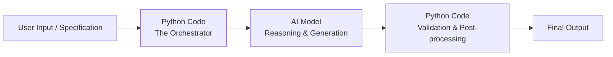

# Getting Started with Python

---

## Python's Role — The Orchestration Layer

In the era of AI-native engineering, Python is the definitive language of choice. While foundation models (like Claude, OpenAI, or Gemini) perform the heavy lifting of language processing and generation, these models do not operate in a vacuum. They need a robust, deterministic environment to manage them. **Python serves as this orchestration layer.**

### What does the Orchestration Layer do?
You will not use Python to build AI from scratch. You will use Python as the control center. Think of it like a restaurant. The **waiter** (Python) takes your order, validates that the items exist, passes it to the kitchen, collects the food, and brings it to your table. The **chef** (the AI) does the actual cooking. The waiter does not cook — but without the waiter, nothing reaches the customer in an organized, reliable way.

Python's role is specifically to:
1. **Prepare and Format:** Gather user inputs and translate them into a precise specification (prompt) for the AI model.
2. **Execute the Call:** Use API libraries to securely send the specification to the AI model.
3. **Validate and Parse:** Receive the AI's response, check it for correct formatting, handle any errors, and extract the relevant information.
4. **Integrate:** Pass the validated data back to the database, a user interface, or the next step in a data pipeline.



### Why Python?
- **Readable syntax:** Python code reads almost like plain English. A line like `if score > 50:` needs almost no translation.
- **Huge AI ecosystem:** Anthropic, OpenAI, Google, and almost every AI company provide official Python tools to call their models.
- **Industry Standard:** It is one of the most in-demand languages for data science, AI engineering, and backend development globally.

---

## Setting Up Google Colab

Normally, to write Python you would need to install Python on your computer plus a separate editor. This involves different steps for Windows vs Mac, version conflicts, and troubleshooting. **Google Colab** eliminates all of this — it is a ready-to-use Python environment that runs entirely in your web browser. No installation. No setup. Free.

### Step-by-Step Guide: Accessing Colab for the First Time

**Step 1: Open your browser and go to the Colab website.**
Type `colab.research.google.com` into the address bar at the top of your browser and press Enter. This takes you directly to Google Colab's homepage.

**Step 2: Sign in with your Google account.**
Colab will ask you to sign in. Use the same Google account you use for Gmail or Google Drive. Your notebooks (the files you'll create) are saved to *your* Google Drive.

**Step 3: Create a brand-new, empty notebook.**
Click on **File** in the top-left menu, then click **New notebook**. A **notebook** is the document where you'll write and run your Python code. Google Colab will now open a fresh, empty notebook for you, with one empty **cell** already waiting.

**Step 4: Give your notebook a proper name.**
At the top-left of the page, you will see a default name like `Untitled0.ipynb`. Click directly on this name and rename it to something meaningful, such as `unit-1-1-first-program`.

**Step 5: Locate the first code cell.**
Look for the empty box on the page with a small "play" (▶) button on its left side. This is a **cell** — the box where you type your Python code.

**Step 6: Type your first line of code into the cell.**
Click inside the empty cell and type exactly this:
```python
print("Hello, world!")
```

**Step 7: Run the cell.**
There are two ways to run a cell:
- Click the ▶ **Run** button on the left side of the cell, or
- Press **Shift + Enter** on your keyboard.

**Step 8: Read the output.**
Within a second or two, you should see `Hello, world!` appear directly underneath the cell. This confirms Colab is active, your Python interpreter is running, and your first program worked correctly.

### Colab Tips Every Beginner Needs to Know

- **How to add a new cell:** Click **+ Code** at the top left of the notebook. Each new cell is independent.
- **Cells share memory within a session:** If you create a variable in cell 1 and run it, that variable is available in cell 2. This shared state is called the **runtime**.
- **What happens when you restart:** If you go to Runtime → Restart Runtime, the shared memory is wiped. Your code is still saved, but you need to run the cells again from the top.
- **Colab auto-saves your work:** Colab automatically saves your notebook to your Google Drive under a folder called "Colab Notebooks."
